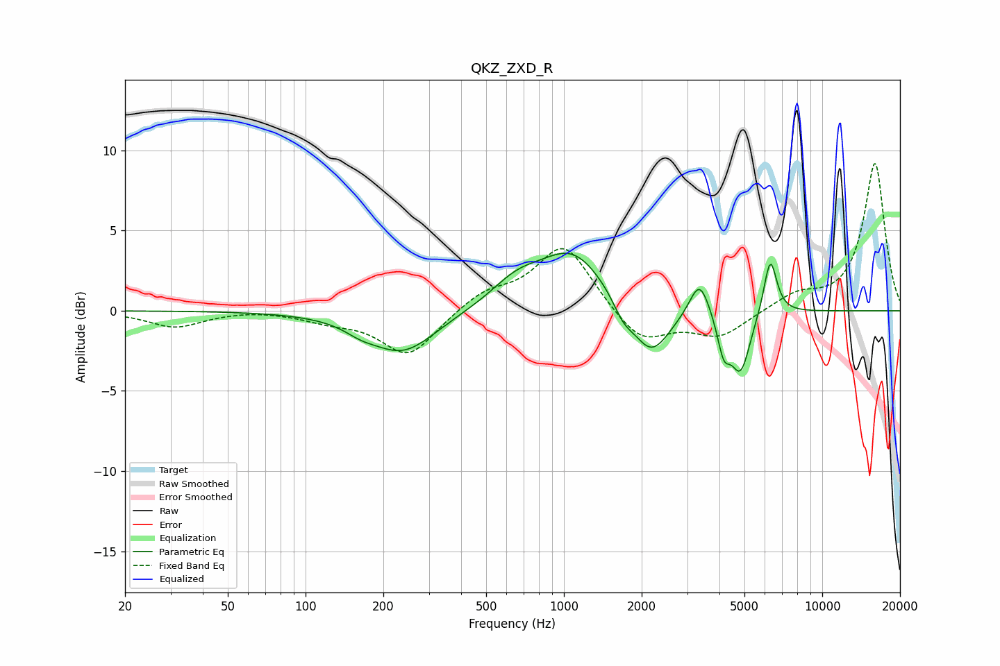

# QKZ_ZXD_R
See [usage instructions](https://github.com/jaakkopasanen/AutoEq#usage) for more options and info.

### Parametric EQs
Apply preamp of -3.7 dB when using parametric equalizer.

|   # | Type    |   Fc (Hz) |    Q |   Gain (dB) |
|-----|---------|-----------|------|-------------|
|   1 | Peaking |       163 | 2.4  |        -0.4 |
|   2 | Peaking |       238 | 1.09 |        -2.6 |
|   3 | Peaking |       656 | 1.4  |         1.4 |
|   4 | Peaking |      1082 | 1.08 |         3.6 |
|   5 | Peaking |      1694 | 3.63 |        -1   |
|   6 | Peaking |      2173 | 1.92 |        -3.2 |
|   7 | Peaking |      3351 | 3.61 |         2.4 |
|   8 | Peaking |      4155 | 5.74 |        -2.1 |
|   9 | Peaking |      4829 | 3.64 |        -3.7 |
|  10 | Peaking |      6292 | 5.41 |         3.6 |

### Fixed Band EQs
When using fixed band (also called graphic) equalizer, apply preamp of **-9.3 dB** (if available) and set gains manually with these parameters.

|   # | Type    |   Fc (Hz) |    Q |   Gain (dB) |
|-----|---------|-----------|------|-------------|
|   1 | Peaking |        31 | 1.41 |        -1   |
|   2 | Peaking |        62 | 1.41 |         0.1 |
|   3 | Peaking |       125 | 1.41 |        -0.5 |
|   4 | Peaking |       250 | 1.41 |        -2.8 |
|   5 | Peaking |       500 | 1.41 |         1.1 |
|   6 | Peaking |      1000 | 1.41 |         4.2 |
|   7 | Peaking |      2000 | 1.41 |        -2.1 |
|   8 | Peaking |      4000 | 1.41 |        -1.6 |
|   9 | Peaking |      8000 | 1.41 |         0.9 |
|  10 | Peaking |     16000 | 1.41 |         9.2 |

### Graphs

