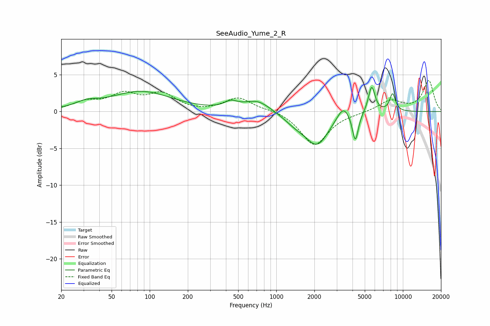

# SeeAudio_Yume_2_R
See [usage instructions](https://github.com/jaakkopasanen/AutoEq#usage) for more options and info.

### Parametric EQs
Apply preamp of -3.4 dB when using parametric equalizer.

|   # | Type    |   Fc (Hz) |    Q |   Gain (dB) |
|-----|---------|-----------|------|-------------|
|   1 | Peaking |        31 | 1.64 |         0.7 |
|   2 | Peaking |        85 | 0.59 |         2.7 |
|   3 | Peaking |       438 | 2.77 |         0.9 |
|   4 | Peaking |       711 | 1.36 |         1.5 |
|   5 | Peaking |      1420 | 1.51 |        -1.1 |
|   6 | Peaking |      2105 | 1.53 |        -4.3 |
|   7 | Peaking |      3369 | 3.02 |         1.8 |
|   8 | Peaking |      4211 | 5.97 |        -4   |
|   9 | Peaking |      5669 | 5.26 |         3.6 |
|  10 | Peaking |      8291 | 5.62 |         2.4 |

### Fixed Band EQs
When using fixed band (also called graphic) equalizer, apply preamp of **-4.3 dB** (if available) and set gains manually with these parameters.

|   # | Type    |   Fc (Hz) |    Q |   Gain (dB) |
|-----|---------|-----------|------|-------------|
|   1 | Peaking |        31 | 1.41 |         1.2 |
|   2 | Peaking |        62 | 1.41 |         2.1 |
|   3 | Peaking |       125 | 1.41 |         2.2 |
|   4 | Peaking |       250 | 1.41 |        -0.1 |
|   5 | Peaking |       500 | 1.41 |         1.9 |
|   6 | Peaking |      1000 | 1.41 |         0.3 |
|   7 | Peaking |      2000 | 1.41 |        -4.6 |
|   8 | Peaking |      4000 | 1.41 |        -0.1 |
|   9 | Peaking |      8000 | 1.41 |         1.5 |
|  10 | Peaking |     16000 | 1.41 |         4.2 |

### Graphs

