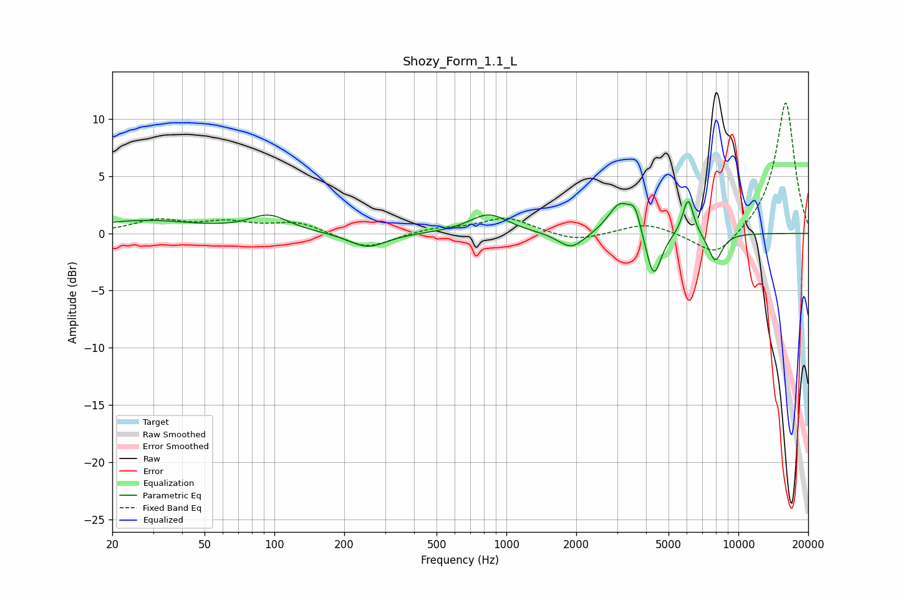

# Shozy_Form_1.1_L
See [usage instructions](https://github.com/jaakkopasanen/AutoEq#usage) for more options and info.

### Parametric EQs
Apply preamp of -2.9 dB when using parametric equalizer.

|   # | Type    |   Fc (Hz) |    Q |   Gain (dB) |
|-----|---------|-----------|------|-------------|
|   1 | Peaking |        27 | 0.61 |         1.1 |
|   2 | Peaking |        95 | 1.68 |         1.4 |
|   3 | Peaking |       253 | 1.76 |        -1.3 |
|   4 | Peaking |       839 | 1.71 |         1.7 |
|   5 | Peaking |      1907 | 2.43 |        -1.5 |
|   6 | Peaking |      3084 | 2.78 |         2.7 |
|   7 | Peaking |      3585 | 5.55 |         1.8 |
|   8 | Peaking |      4310 | 4.21 |        -4.2 |
|   9 | Peaking |      6073 | 5.8  |         3.3 |
|  10 | Peaking |      7947 | 4.32 |        -2.5 |

### Fixed Band EQs
When using fixed band (also called graphic) equalizer, apply preamp of **-11.5 dB** (if available) and set gains manually with these parameters.

|   # | Type    |   Fc (Hz) |    Q |   Gain (dB) |
|-----|---------|-----------|------|-------------|
|   1 | Peaking |        31 | 1.41 |         1.1 |
|   2 | Peaking |        62 | 1.41 |         0.8 |
|   3 | Peaking |       125 | 1.41 |         1   |
|   4 | Peaking |       250 | 1.41 |        -1.4 |
|   5 | Peaking |       500 | 1.41 |         0.4 |
|   6 | Peaking |      1000 | 1.41 |         1.4 |
|   7 | Peaking |      2000 | 1.41 |        -0.8 |
|   8 | Peaking |      4000 | 1.41 |         0.9 |
|   9 | Peaking |      8000 | 1.41 |        -2.3 |
|  10 | Peaking |     16000 | 1.41 |        11.6 |

### Graphs

