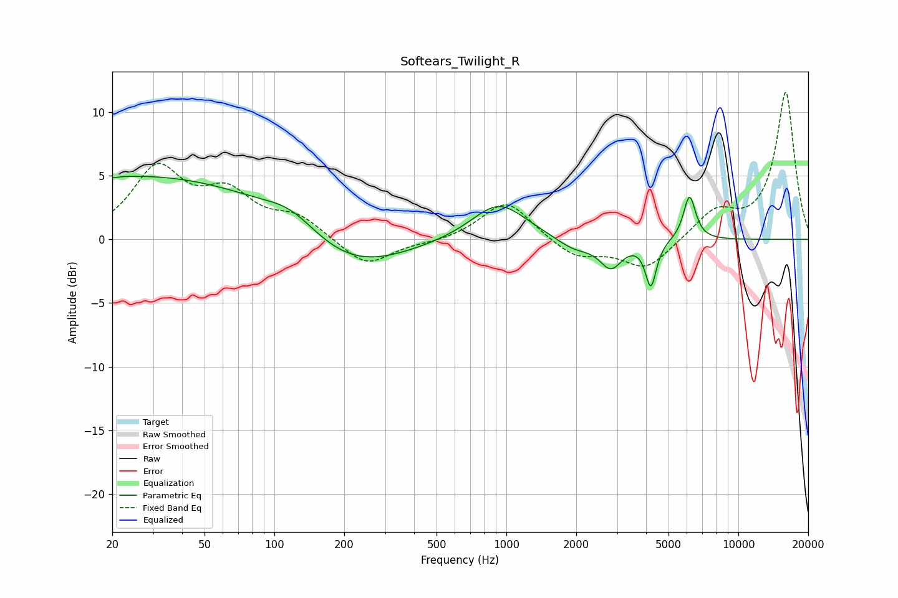

# Softears_Twilight_R
See [usage instructions](https://github.com/jaakkopasanen/AutoEq#usage) for more options and info.

### Parametric EQs
Apply preamp of -5.1 dB when using parametric equalizer.

|   # | Type    |   Fc (Hz) |    Q |   Gain (dB) |
|-----|---------|-----------|------|-------------|
|   1 | Peaking |        20 | 5.89 |         3.2 |
|   2 | Peaking |        20 | 5.99 |        -3.3 |
|   3 | Peaking |        27 | 0.23 |         5   |
|   4 | Peaking |       118 | 1.24 |         1.4 |
|   5 | Peaking |       208 | 0.61 |        -2.9 |
|   6 | Peaking |       927 | 1.2  |         3   |
|   7 | Peaking |      1955 | 1.81 |        -0.9 |
|   8 | Peaking |      2821 | 2.95 |        -2.1 |
|   9 | Peaking |      4195 | 5.98 |        -3.6 |
|  10 | Peaking |      6160 | 5.29 |         3.5 |

### Fixed Band EQs
When using fixed band (also called graphic) equalizer, apply preamp of **-11.6 dB** (if available) and set gains manually with these parameters.

|   # | Type    |   Fc (Hz) |    Q |   Gain (dB) |
|-----|---------|-----------|------|-------------|
|   1 | Peaking |        31 | 1.41 |         5.3 |
|   2 | Peaking |        62 | 1.41 |         3.2 |
|   3 | Peaking |       125 | 1.41 |         1.6 |
|   4 | Peaking |       250 | 1.41 |        -2.2 |
|   5 | Peaking |       500 | 1.41 |        -0.2 |
|   6 | Peaking |      1000 | 1.41 |         3.1 |
|   7 | Peaking |      2000 | 1.41 |        -1.5 |
|   8 | Peaking |      4000 | 1.41 |        -2.4 |
|   9 | Peaking |      8000 | 1.41 |         2.1 |
|  10 | Peaking |     16000 | 1.41 |        11.6 |

### Graphs

