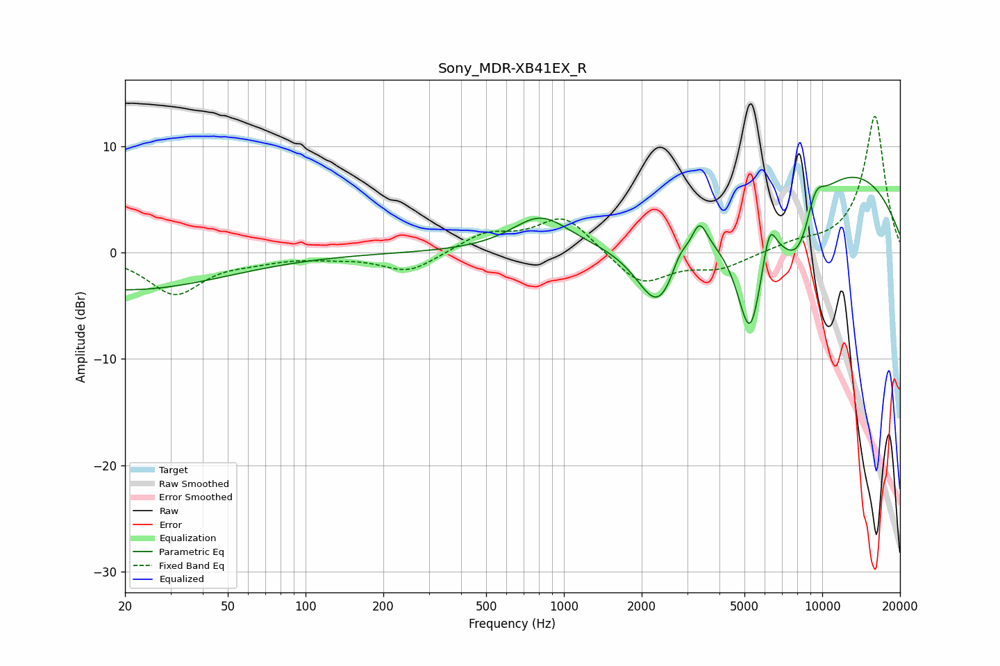

# Sony_MDR-XB41EX_R
See [usage instructions](https://github.com/jaakkopasanen/AutoEq#usage) for more options and info.

### Parametric EQs
Apply preamp of -7.2 dB when using parametric equalizer.

|   # | Type    |   Fc (Hz) |    Q |   Gain (dB) |
|-----|---------|-----------|------|-------------|
|   1 | Peaking |        20 | 0.36 |        -3.5 |
|   2 | Peaking |       812 | 1.28 |         3.2 |
|   3 | Peaking |      2326 | 1.61 |        -7.2 |
|   4 | Peaking |      2805 | 4.45 |         1.5 |
|   5 | Peaking |      3346 | 4.67 |         2.7 |
|   6 | Peaking |      5252 | 2.36 |       -12.1 |
|   7 | Peaking |      6240 | 5.01 |         3.8 |
|   8 | Peaking |      8137 | 1.58 |        -7.2 |
|   9 | Peaking |      9370 | 3.34 |         3.1 |
|  10 | Peaking |     10000 | 0.28 |         8.9 |

### Fixed Band EQs
When using fixed band (also called graphic) equalizer, apply preamp of **-12.9 dB** (if available) and set gains manually with these parameters.

|   # | Type    |   Fc (Hz) |    Q |   Gain (dB) |
|-----|---------|-----------|------|-------------|
|   1 | Peaking |        31 | 1.41 |        -3.8 |
|   2 | Peaking |        62 | 1.41 |        -0.5 |
|   3 | Peaking |       125 | 1.41 |        -0.3 |
|   4 | Peaking |       250 | 1.41 |        -1.9 |
|   5 | Peaking |       500 | 1.41 |         1.7 |
|   6 | Peaking |      1000 | 1.41 |         3.5 |
|   7 | Peaking |      2000 | 1.41 |        -3.1 |
|   8 | Peaking |      4000 | 1.41 |        -1.4 |
|   9 | Peaking |      8000 | 1.41 |         0.7 |
|  10 | Peaking |     16000 | 1.41 |        12.9 |

### Graphs

