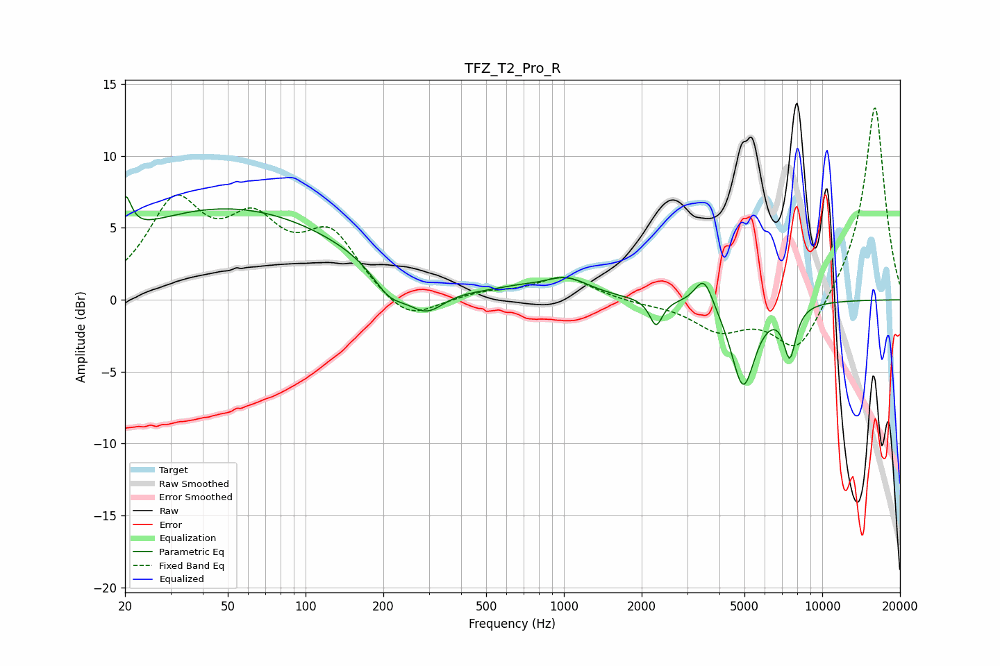

# TFZ_T2_Pro_R
See [usage instructions](https://github.com/jaakkopasanen/AutoEq#usage) for more options and info.

### Parametric EQs
Apply preamp of -7.3 dB when using parametric equalizer.

|   # | Type    |   Fc (Hz) |    Q |   Gain (dB) |
|-----|---------|-----------|------|-------------|
|   1 | Peaking |        20 | 5.97 |         2.7 |
|   2 | Peaking |        50 | 0.29 |         6.3 |
|   3 | Peaking |       211 | 2.13 |        -1.8 |
|   4 | Peaking |       292 | 1.93 |        -2   |
|   5 | Peaking |       662 | 1.56 |         0.4 |
|   6 | Peaking |      1023 | 1.55 |         1.3 |
|   7 | Peaking |      2274 | 5.83 |        -1.9 |
|   8 | Peaking |      3485 | 3.98 |         2.2 |
|   9 | Peaking |      4942 | 3.01 |        -6   |
|  10 | Peaking |      7489 | 5.56 |        -3.5 |

### Fixed Band EQs
When using fixed band (also called graphic) equalizer, apply preamp of **-13.5 dB** (if available) and set gains manually with these parameters.

|   # | Type    |   Fc (Hz) |    Q |   Gain (dB) |
|-----|---------|-----------|------|-------------|
|   1 | Peaking |        31 | 1.41 |         6.3 |
|   2 | Peaking |        62 | 1.41 |         4.5 |
|   3 | Peaking |       125 | 1.41 |         4.2 |
|   4 | Peaking |       250 | 1.41 |        -1.8 |
|   5 | Peaking |       500 | 1.41 |         0.5 |
|   6 | Peaking |      1000 | 1.41 |         1.6 |
|   7 | Peaking |      2000 | 1.41 |        -0.2 |
|   8 | Peaking |      4000 | 1.41 |        -2   |
|   9 | Peaking |      8000 | 1.41 |        -3.8 |
|  10 | Peaking |     16000 | 1.41 |        13.7 |

### Graphs

