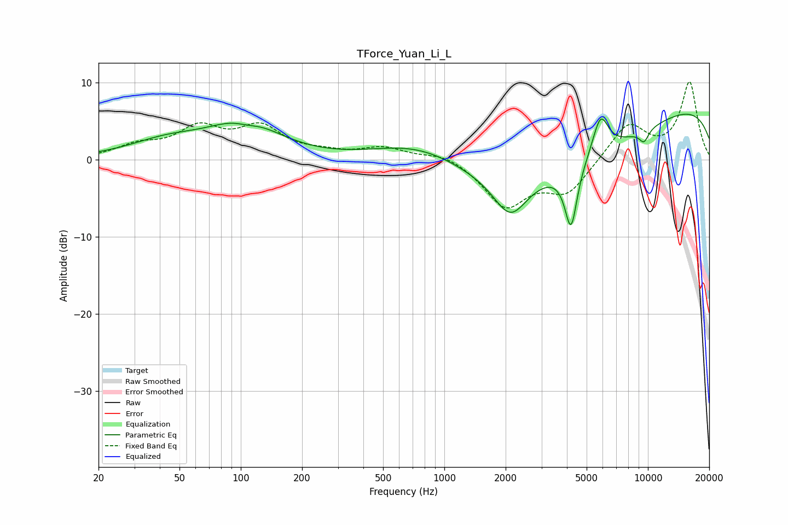

# TForce_Yuan_Li_L
See [usage instructions](https://github.com/jaakkopasanen/AutoEq#usage) for more options and info.

### Parametric EQs
Apply preamp of -6.0 dB when using parametric equalizer.

|   # | Type    |   Fc (Hz) |    Q |   Gain (dB) |
|-----|---------|-----------|------|-------------|
|   1 | Peaking |        43 | 0.74 |         2.1 |
|   2 | Peaking |       105 | 0.85 |         4.7 |
|   3 | Peaking |       107 | 2.16 |        -0.8 |
|   4 | Peaking |       756 | 0.47 |         7.6 |
|   5 | Peaking |      2106 | 0.18 |        -8.8 |
|   6 | Peaking |      2111 | 1.69 |        -5.3 |
|   7 | Peaking |      4191 | 4.55 |        -8.2 |
|   8 | Peaking |      5850 | 3.46 |         5.1 |
|   9 | Peaking |      9561 | 5.31 |        -1.6 |
|  10 | Peaking |     10000 | 0.18 |         8.3 |

### Fixed Band EQs
When using fixed band (also called graphic) equalizer, apply preamp of **-10.2 dB** (if available) and set gains manually with these parameters.

|   # | Type    |   Fc (Hz) |    Q |   Gain (dB) |
|-----|---------|-----------|------|-------------|
|   1 | Peaking |        31 | 1.41 |         1.6 |
|   2 | Peaking |        62 | 1.41 |         3.8 |
|   3 | Peaking |       125 | 1.41 |         3.9 |
|   4 | Peaking |       250 | 1.41 |         0.6 |
|   5 | Peaking |       500 | 1.41 |         1.5 |
|   6 | Peaking |      1000 | 1.41 |         1   |
|   7 | Peaking |      2000 | 1.41 |        -5.9 |
|   8 | Peaking |      4000 | 1.41 |        -4.1 |
|   9 | Peaking |      8000 | 1.41 |         4.7 |
|  10 | Peaking |     16000 | 1.41 |        10   |

### Graphs

