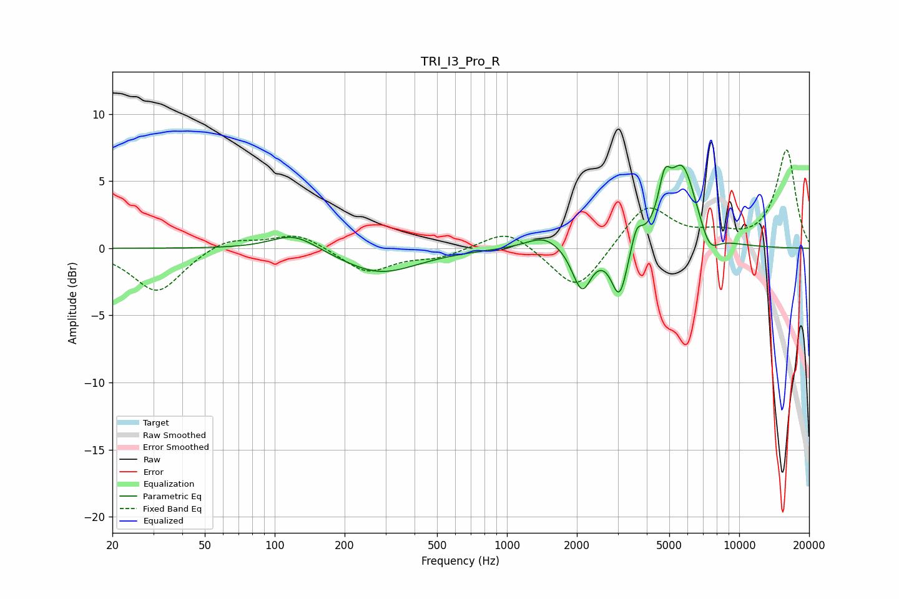

# TRI_I3_Pro_R
See [usage instructions](https://github.com/jaakkopasanen/AutoEq#usage) for more options and info.

### Parametric EQs
Apply preamp of -6.3 dB when using parametric equalizer.

|   # | Type    |   Fc (Hz) |    Q |   Gain (dB) |
|-----|---------|-----------|------|-------------|
|   1 | Peaking |       121 | 1.43 |         1.3 |
|   2 | Peaking |       283 | 0.87 |        -1.9 |
|   3 | Peaking |      1450 | 1.82 |         1   |
|   4 | Peaking |      2017 | 3.52 |        -0.8 |
|   5 | Peaking |      2126 | 3.76 |        -2.4 |
|   6 | Peaking |      3052 | 4.05 |        -3.9 |
|   7 | Peaking |      3615 | 6    |         1.6 |
|   8 | Peaking |      4769 | 5.61 |         2.8 |
|   9 | Peaking |      5696 | 2.19 |         6.1 |
|  10 | Peaking |      7438 | 3.26 |        -1.7 |

### Fixed Band EQs
When using fixed band (also called graphic) equalizer, apply preamp of **-7.4 dB** (if available) and set gains manually with these parameters.

|   # | Type    |   Fc (Hz) |    Q |   Gain (dB) |
|-----|---------|-----------|------|-------------|
|   1 | Peaking |        31 | 1.41 |        -3.3 |
|   2 | Peaking |        62 | 1.41 |         0.9 |
|   3 | Peaking |       125 | 1.41 |         1.2 |
|   4 | Peaking |       250 | 1.41 |        -1.8 |
|   5 | Peaking |       500 | 1.41 |        -0.6 |
|   6 | Peaking |      1000 | 1.41 |         1.5 |
|   7 | Peaking |      2000 | 1.41 |        -3.4 |
|   8 | Peaking |      4000 | 1.41 |         3.3 |
|   9 | Peaking |      8000 | 1.41 |         0.8 |
|  10 | Peaking |     16000 | 1.41 |         7.3 |

### Graphs

