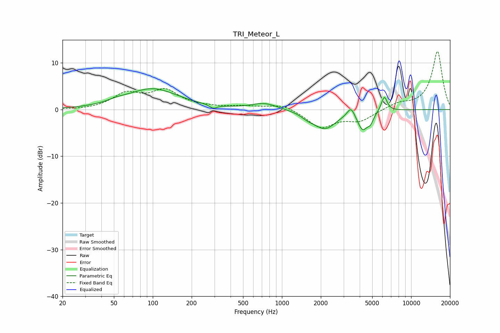

# TRI_Meteor_L
See [usage instructions](https://github.com/jaakkopasanen/AutoEq#usage) for more options and info.

### Parametric EQs
Apply preamp of -4.5 dB when using parametric equalizer.

|   # | Type    |   Fc (Hz) |    Q |   Gain (dB) |
|-----|---------|-----------|------|-------------|
|   1 | Peaking |        53 | 2.03 |         0.5 |
|   2 | Peaking |        99 | 0.72 |         4.4 |
|   3 | Peaking |       293 | 5.01 |        -0.8 |
|   4 | Peaking |       734 | 1.43 |         1.4 |
|   5 | Peaking |      1587 | 2.71 |        -0.8 |
|   6 | Peaking |      2152 | 1.62 |        -3.9 |
|   7 | Peaking |      3425 | 4.86 |         2.2 |
|   8 | Peaking |      4213 | 3.56 |        -3.9 |
|   9 | Peaking |      4852 | 6    |        -1.6 |
|  10 | Peaking |      6196 | 5.93 |         3.2 |

### Fixed Band EQs
When using fixed band (also called graphic) equalizer, apply preamp of **-12.5 dB** (if available) and set gains manually with these parameters.

|   # | Type    |   Fc (Hz) |    Q |   Gain (dB) |
|-----|---------|-----------|------|-------------|
|   1 | Peaking |        31 | 1.41 |        -0.1 |
|   2 | Peaking |        62 | 1.41 |         3.2 |
|   3 | Peaking |       125 | 1.41 |         3.8 |
|   4 | Peaking |       250 | 1.41 |         0.4 |
|   5 | Peaking |       500 | 1.41 |         0.6 |
|   6 | Peaking |      1000 | 1.41 |         1.2 |
|   7 | Peaking |      2000 | 1.41 |        -3.8 |
|   8 | Peaking |      4000 | 1.41 |        -2.3 |
|   9 | Peaking |      8000 | 1.41 |         1.2 |
|  10 | Peaking |     16000 | 1.41 |        12.5 |

### Graphs

