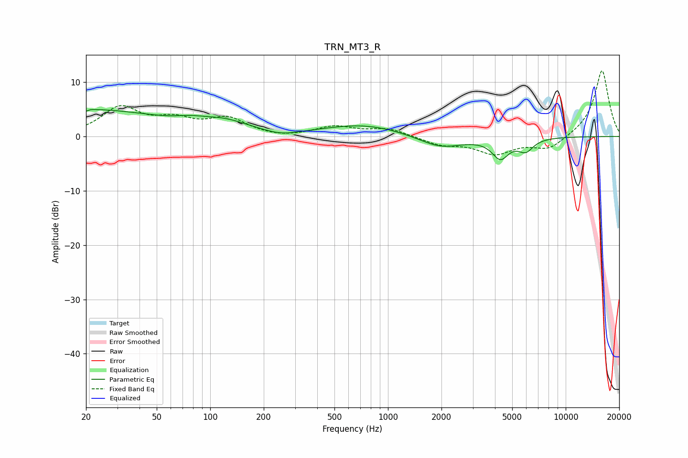

# TRN_MT3_R
See [usage instructions](https://github.com/jaakkopasanen/AutoEq#usage) for more options and info.

### Parametric EQs
Apply preamp of -5.1 dB when using parametric equalizer.

|   # | Type    |   Fc (Hz) |    Q |   Gain (dB) |
|-----|---------|-----------|------|-------------|
|   1 | Peaking |        20 | 0.32 |         4.9 |
|   2 | Peaking |        20 | 5.98 |        -3.4 |
|   3 | Peaking |        20 | 5.88 |         3.2 |
|   4 | Peaking |        77 | 1.82 |         0.7 |
|   5 | Peaking |       120 | 1.01 |         2   |
|   6 | Peaking |       252 | 1.58 |        -0.8 |
|   7 | Peaking |       727 | 0.63 |         2.2 |
|   8 | Peaking |      1977 | 1.13 |        -2.3 |
|   9 | Peaking |      4290 | 2.98 |        -3.6 |
|  10 | Peaking |      5960 | 3.23 |        -2.2 |

### Fixed Band EQs
When using fixed band (also called graphic) equalizer, apply preamp of **-12.2 dB** (if available) and set gains manually with these parameters.

|   # | Type    |   Fc (Hz) |    Q |   Gain (dB) |
|-----|---------|-----------|------|-------------|
|   1 | Peaking |        31 | 1.41 |         5.1 |
|   2 | Peaking |        62 | 1.41 |         2.6 |
|   3 | Peaking |       125 | 1.41 |         3.1 |
|   4 | Peaking |       250 | 1.41 |        -0.4 |
|   5 | Peaking |       500 | 1.41 |         1.7 |
|   6 | Peaking |      1000 | 1.41 |         1.4 |
|   7 | Peaking |      2000 | 1.41 |        -1.4 |
|   8 | Peaking |      4000 | 1.41 |        -3   |
|   9 | Peaking |      8000 | 1.41 |        -2.4 |
|  10 | Peaking |     16000 | 1.41 |        12.3 |

### Graphs

