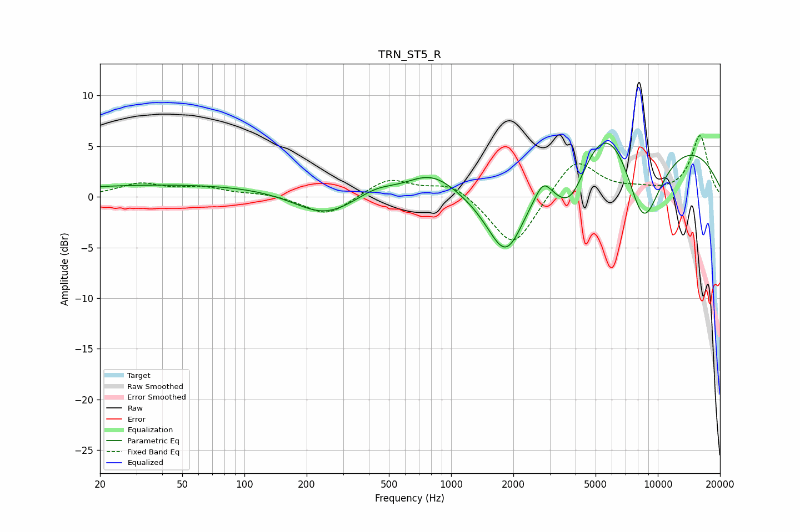

# TRN_ST5_R
See [usage instructions](https://github.com/jaakkopasanen/AutoEq#usage) for more options and info.

### Parametric EQs
Apply preamp of -5.4 dB when using parametric equalizer.

|   # | Type    |   Fc (Hz) |    Q |   Gain (dB) |
|-----|---------|-----------|------|-------------|
|   1 | Peaking |        59 | 0.18 |         1.3 |
|   2 | Peaking |       242 | 0.94 |        -2.4 |
|   3 | Peaking |       435 | 1.48 |         1   |
|   4 | Peaking |       801 | 1.1  |         2.7 |
|   5 | Peaking |      1759 | 0.34 |        -5.1 |
|   6 | Peaking |      1850 | 1.4  |        -8.3 |
|   7 | Peaking |      2791 | 3.81 |         1.6 |
|   8 | Peaking |      3779 | 1.33 |        -8.4 |
|   9 | Peaking |      5607 | 0.33 |        20   |
|  10 | Peaking |      8461 | 0.95 |       -15.9 |

### Fixed Band EQs
When using fixed band (also called graphic) equalizer, apply preamp of **-6.1 dB** (if available) and set gains manually with these parameters.

|   # | Type    |   Fc (Hz) |    Q |   Gain (dB) |
|-----|---------|-----------|------|-------------|
|   1 | Peaking |        31 | 1.41 |         1.2 |
|   2 | Peaking |        62 | 1.41 |         0.8 |
|   3 | Peaking |       125 | 1.41 |         0.3 |
|   4 | Peaking |       250 | 1.41 |        -1.9 |
|   5 | Peaking |       500 | 1.41 |         1.8 |
|   6 | Peaking |      1000 | 1.41 |         1.4 |
|   7 | Peaking |      2000 | 1.41 |        -5.3 |
|   8 | Peaking |      4000 | 1.41 |         4   |
|   9 | Peaking |      8000 | 1.41 |         0.5 |
|  10 | Peaking |     16000 | 1.41 |         6   |

### Graphs

