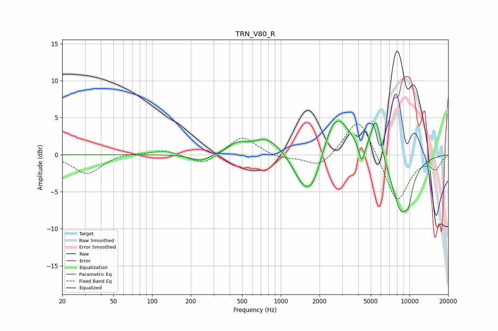

# TRN_V80_R
See [usage instructions](https://github.com/jaakkopasanen/AutoEq#usage) for more options and info.

### Parametric EQs
Apply preamp of -4.6 dB when using parametric equalizer.

|   # | Type    |   Fc (Hz) |    Q |   Gain (dB) |
|-----|---------|-----------|------|-------------|
|   1 | Peaking |       239 | 1.98 |        -1   |
|   2 | Peaking |       454 | 2.19 |         1.1 |
|   3 | Peaking |       776 | 1.21 |         2.3 |
|   4 | Peaking |      1425 | 1.97 |        -2   |
|   5 | Peaking |      1753 | 1.66 |        -5.9 |
|   6 | Peaking |      2655 | 1.29 |         6.6 |
|   7 | Peaking |      4260 | 5.99 |        -2.8 |
|   8 | Peaking |      5499 | 3.57 |         5.5 |
|   9 | Peaking |      8628 | 1.65 |        -7.8 |
|  10 | Peaking |      9853 | 5.3  |        -1.8 |

### Fixed Band EQs
When using fixed band (also called graphic) equalizer, apply preamp of **-4.2 dB** (if available) and set gains manually with these parameters.

|   # | Type    |   Fc (Hz) |    Q |   Gain (dB) |
|-----|---------|-----------|------|-------------|
|   1 | Peaking |        31 | 1.41 |        -2.6 |
|   2 | Peaking |        62 | 1.41 |         0.3 |
|   3 | Peaking |       125 | 1.41 |         0.7 |
|   4 | Peaking |       250 | 1.41 |        -1.5 |
|   5 | Peaking |       500 | 1.41 |         2.6 |
|   6 | Peaking |      1000 | 1.41 |        -0.6 |
|   7 | Peaking |      2000 | 1.41 |        -1.8 |
|   8 | Peaking |      4000 | 1.41 |         5.5 |
|   9 | Peaking |      8000 | 1.41 |        -6.6 |
|  10 | Peaking |     16000 | 1.41 |        -1.8 |

### Graphs

