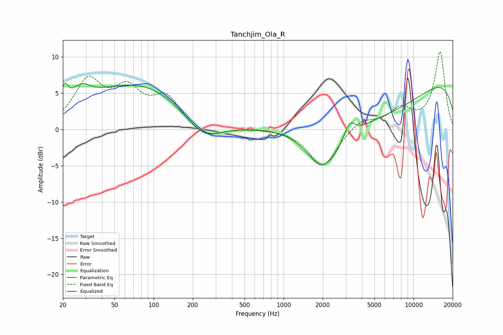

# Tanchjim_Ola_R
See [usage instructions](https://github.com/jaakkopasanen/AutoEq#usage) for more options and info.

### Parametric EQs
Apply preamp of -6.5 dB when using parametric equalizer.

|   # | Type    |   Fc (Hz) |    Q |   Gain (dB) |
|-----|---------|-----------|------|-------------|
|   1 | Peaking |        21 | 5.35 |         2.6 |
|   2 | Peaking |        27 | 1.96 |         2.3 |
|   3 | Peaking |        83 | 0.31 |         6.6 |
|   4 | Peaking |       238 | 0.84 |        -4.3 |
|   5 | Peaking |      1845 | 1.97 |        -1.3 |
|   6 | Peaking |      2156 | 0.9  |        -5.9 |
|   7 | Peaking |      3135 | 5.72 |        -0.5 |
|   8 | Peaking |      3189 | 3.51 |         2.9 |
|   9 | Peaking |      6172 | 0.34 |        -6.2 |
|  10 | Peaking |      9309 | 0.18 |         9.5 |

### Fixed Band EQs
When using fixed band (also called graphic) equalizer, apply preamp of **-10.8 dB** (if available) and set gains manually with these parameters.

|   # | Type    |   Fc (Hz) |    Q |   Gain (dB) |
|-----|---------|-----------|------|-------------|
|   1 | Peaking |        31 | 1.41 |         6.3 |
|   2 | Peaking |        62 | 1.41 |         4.7 |
|   3 | Peaking |       125 | 1.41 |         4.1 |
|   4 | Peaking |       250 | 1.41 |        -1.5 |
|   5 | Peaking |       500 | 1.41 |         0.1 |
|   6 | Peaking |      1000 | 1.41 |         0.1 |
|   7 | Peaking |      2000 | 1.41 |        -5.2 |
|   8 | Peaking |      4000 | 1.41 |         1.5 |
|   9 | Peaking |      8000 | 1.41 |         2.6 |
|  10 | Peaking |     16000 | 1.41 |        10.7 |

### Graphs

