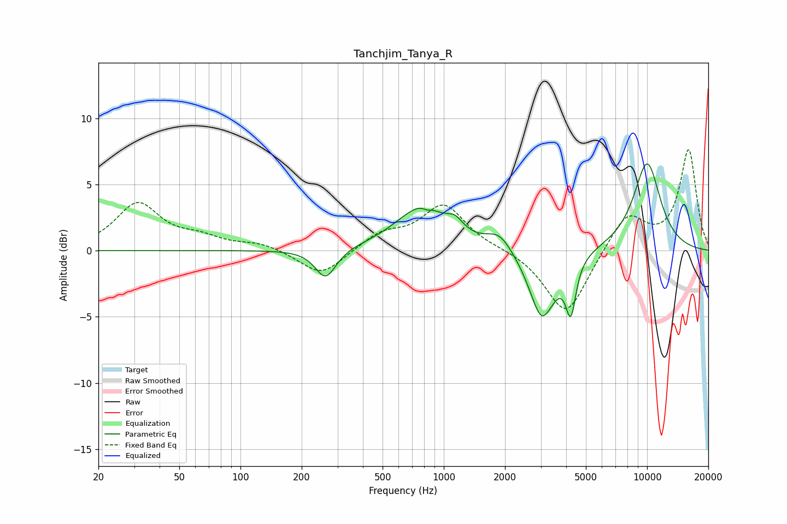

# Tanchjim_Tanya_R
See [usage instructions](https://github.com/jaakkopasanen/AutoEq#usage) for more options and info.

### Parametric EQs
Apply preamp of -6.6 dB when using parametric equalizer.

|   # | Type    |   Fc (Hz) |    Q |   Gain (dB) |
|-----|---------|-----------|------|-------------|
|   1 | Peaking |       262 | 2.76 |        -2.3 |
|   2 | Peaking |       774 | 1.1  |         3.1 |
|   3 | Peaking |       819 | 3.79 |         0.3 |
|   4 | Peaking |       826 | 5.83 |        -0.4 |
|   5 | Peaking |      1136 | 3.47 |         0.9 |
|   6 | Peaking |      1876 | 2.23 |         1.3 |
|   7 | Peaking |      3065 | 2.21 |        -5.4 |
|   8 | Peaking |      3238 | 6    |         0.2 |
|   9 | Peaking |      4215 | 5.69 |        -3.9 |
|  10 | Peaking |     10000 | 1.75 |         6.6 |

### Fixed Band EQs
When using fixed band (also called graphic) equalizer, apply preamp of **-7.7 dB** (if available) and set gains manually with these parameters.

|   # | Type    |   Fc (Hz) |    Q |   Gain (dB) |
|-----|---------|-----------|------|-------------|
|   1 | Peaking |        31 | 1.41 |         3.5 |
|   2 | Peaking |        62 | 1.41 |         0.8 |
|   3 | Peaking |       125 | 1.41 |         0.5 |
|   4 | Peaking |       250 | 1.41 |        -2   |
|   5 | Peaking |       500 | 1.41 |         1.2 |
|   6 | Peaking |      1000 | 1.41 |         3.4 |
|   7 | Peaking |      2000 | 1.41 |         0.1 |
|   8 | Peaking |      4000 | 1.41 |        -5   |
|   9 | Peaking |      8000 | 1.41 |         2.8 |
|  10 | Peaking |     16000 | 1.41 |         7.6 |

### Graphs

