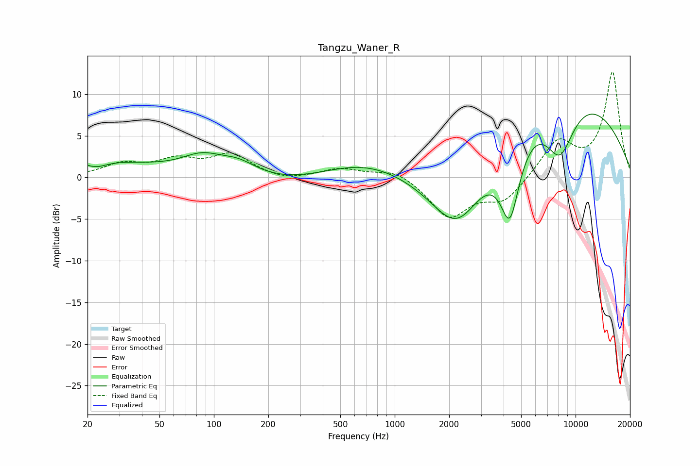

# Tangzu_Waner_R
See [usage instructions](https://github.com/jaakkopasanen/AutoEq#usage) for more options and info.

### Parametric EQs
Apply preamp of -7.7 dB when using parametric equalizer.

|   # | Type    |   Fc (Hz) |    Q |   Gain (dB) |
|-----|---------|-----------|------|-------------|
|   1 | Peaking |        20 | 0.38 |         2   |
|   2 | Peaking |        22 | 2.4  |        -0.8 |
|   3 | Peaking |        86 | 1.24 |         2   |
|   4 | Peaking |       137 | 1.33 |         1.6 |
|   5 | Peaking |       667 | 0.48 |         4.8 |
|   6 | Peaking |      1130 | 0.19 |        -4.2 |
|   7 | Peaking |      2220 | 0.88 |        -9.1 |
|   8 | Peaking |      4334 | 2.45 |        -9.6 |
|   9 | Peaking |      6857 | 0.27 |        13.1 |
|  10 | Peaking |      8179 | 1.51 |        -7.4 |

### Fixed Band EQs
When using fixed band (also called graphic) equalizer, apply preamp of **-12.7 dB** (if available) and set gains manually with these parameters.

|   # | Type    |   Fc (Hz) |    Q |   Gain (dB) |
|-----|---------|-----------|------|-------------|
|   1 | Peaking |        31 | 1.41 |         1.5 |
|   2 | Peaking |        62 | 1.41 |         1.8 |
|   3 | Peaking |       125 | 1.41 |         2.6 |
|   4 | Peaking |       250 | 1.41 |        -0.5 |
|   5 | Peaking |       500 | 1.41 |         1   |
|   6 | Peaking |      1000 | 1.41 |         1.1 |
|   7 | Peaking |      2000 | 1.41 |        -4.7 |
|   8 | Peaking |      4000 | 1.41 |        -2.8 |
|   9 | Peaking |      8000 | 1.41 |         4.3 |
|  10 | Peaking |     16000 | 1.41 |        12.6 |

### Graphs

