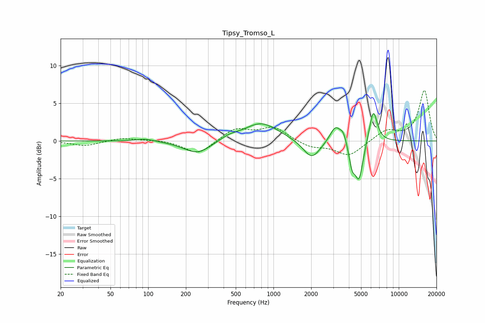

# Tipsy_Tromso_L
See [usage instructions](https://github.com/jaakkopasanen/AutoEq#usage) for more options and info.

### Parametric EQs
Apply preamp of -3.7 dB when using parametric equalizer.

|   # | Type    |   Fc (Hz) |    Q |   Gain (dB) |
|-----|---------|-----------|------|-------------|
|   1 | Peaking |        95 | 1.8  |         0.4 |
|   2 | Peaking |       247 | 1.28 |        -1.8 |
|   3 | Peaking |       443 | 1.92 |         0.5 |
|   4 | Peaking |       799 | 1.04 |         2.4 |
|   5 | Peaking |      2020 | 2.07 |        -2.5 |
|   6 | Peaking |      3130 | 3.15 |         2.3 |
|   7 | Peaking |      3606 | 6    |         1.1 |
|   8 | Peaking |      4237 | 5.98 |        -2.6 |
|   9 | Peaking |      4814 | 4.25 |        -5.1 |
|  10 | Peaking |      6263 | 4.37 |         4.4 |

### Fixed Band EQs
When using fixed band (also called graphic) equalizer, apply preamp of **-6.8 dB** (if available) and set gains manually with these parameters.

|   # | Type    |   Fc (Hz) |    Q |   Gain (dB) |
|-----|---------|-----------|------|-------------|
|   1 | Peaking |        31 | 1.41 |        -0.7 |
|   2 | Peaking |        62 | 1.41 |         0.4 |
|   3 | Peaking |       125 | 1.41 |         0.2 |
|   4 | Peaking |       250 | 1.41 |        -1.8 |
|   5 | Peaking |       500 | 1.41 |         1.6 |
|   6 | Peaking |      1000 | 1.41 |         1.8 |
|   7 | Peaking |      2000 | 1.41 |        -0.8 |
|   8 | Peaking |      4000 | 1.41 |        -2   |
|   9 | Peaking |      8000 | 1.41 |         1.4 |
|  10 | Peaking |     16000 | 1.41 |         6.7 |

### Graphs

