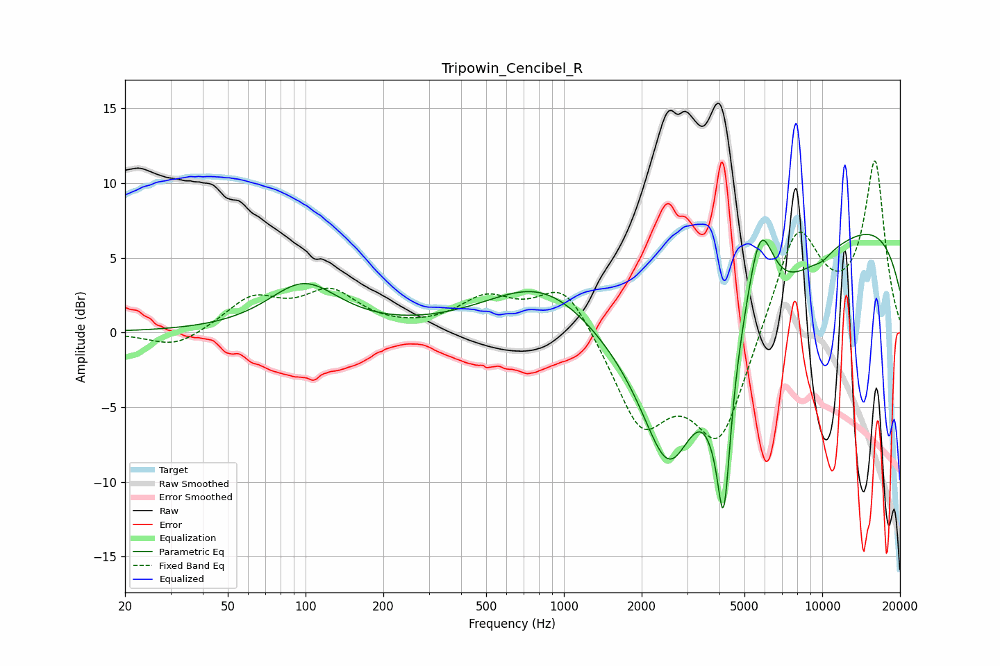

# Tripowin_Cencibel_R
See [usage instructions](https://github.com/jaakkopasanen/AutoEq#usage) for more options and info.

### Parametric EQs
Apply preamp of -6.7 dB when using parametric equalizer.

|   # | Type    |   Fc (Hz) |    Q |   Gain (dB) |
|-----|---------|-----------|------|-------------|
|   1 | Peaking |        98 | 1.05 |         3.2 |
|   2 | Peaking |       843 | 0.65 |         4   |
|   3 | Peaking |      2548 | 1.26 |        -9.5 |
|   4 | Peaking |      3743 | 3.67 |        -1.1 |
|   5 | Peaking |      4123 | 0.25 |        -4.1 |
|   6 | Peaking |      4156 | 5.11 |       -10.5 |
|   7 | Peaking |      5631 | 0.72 |        -2.8 |
|   8 | Peaking |      5741 | 2.49 |         6.7 |
|   9 | Peaking |     10000 | 0.2  |         9.1 |
|  10 | Peaking |     10000 | 4.03 |        -0.3 |

### Fixed Band EQs
When using fixed band (also called graphic) equalizer, apply preamp of **-11.6 dB** (if available) and set gains manually with these parameters.

|   # | Type    |   Fc (Hz) |    Q |   Gain (dB) |
|-----|---------|-----------|------|-------------|
|   1 | Peaking |        31 | 1.41 |        -1.1 |
|   2 | Peaking |        62 | 1.41 |         2.2 |
|   3 | Peaking |       125 | 1.41 |         2.5 |
|   4 | Peaking |       250 | 1.41 |         0   |
|   5 | Peaking |       500 | 1.41 |         2.1 |
|   6 | Peaking |      1000 | 1.41 |         3.4 |
|   7 | Peaking |      2000 | 1.41 |        -6   |
|   8 | Peaking |      4000 | 1.41 |        -7.3 |
|   9 | Peaking |      8000 | 1.41 |         7.2 |
|  10 | Peaking |     16000 | 1.41 |        11.3 |

### Graphs

