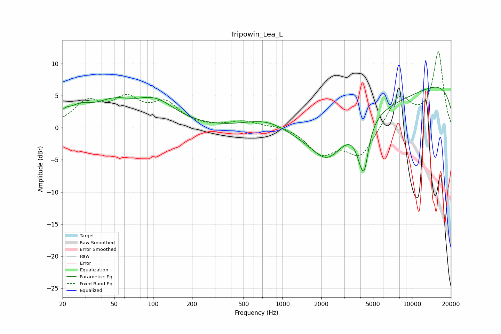

# Tripowin_Lea_L
See [usage instructions](https://github.com/jaakkopasanen/AutoEq#usage) for more options and info.

### Parametric EQs
Apply preamp of -6.4 dB when using parametric equalizer.

|   # | Type    |   Fc (Hz) |    Q |   Gain (dB) |
|-----|---------|-----------|------|-------------|
|   1 | Peaking |        21 | 3.25 |         1.2 |
|   2 | Peaking |        28 | 1.73 |         1.9 |
|   3 | Peaking |        49 | 0.95 |         3.1 |
|   4 | Peaking |       104 | 0.9  |         3.7 |
|   5 | Peaking |       770 | 0.7  |         3.4 |
|   6 | Peaking |      2225 | 1.17 |        -4.8 |
|   7 | Peaking |      3338 | 0.18 |        -5.2 |
|   8 | Peaking |      3937 | 3.61 |        -1.9 |
|   9 | Peaking |      4274 | 4.02 |        -6.6 |
|  10 | Peaking |      9959 | 0.18 |         9.1 |

### Fixed Band EQs
When using fixed band (also called graphic) equalizer, apply preamp of **-12.0 dB** (if available) and set gains manually with these parameters.

|   # | Type    |   Fc (Hz) |    Q |   Gain (dB) |
|-----|---------|-----------|------|-------------|
|   1 | Peaking |        31 | 1.41 |         3.7 |
|   2 | Peaking |        62 | 1.41 |         3.9 |
|   3 | Peaking |       125 | 1.41 |         3.4 |
|   4 | Peaking |       250 | 1.41 |        -0   |
|   5 | Peaking |       500 | 1.41 |         1   |
|   6 | Peaking |      1000 | 1.41 |         0.5 |
|   7 | Peaking |      2000 | 1.41 |        -3.8 |
|   8 | Peaking |      4000 | 1.41 |        -4.5 |
|   9 | Peaking |      8000 | 1.41 |         4.9 |
|  10 | Peaking |     16000 | 1.41 |        11.8 |

### Graphs

