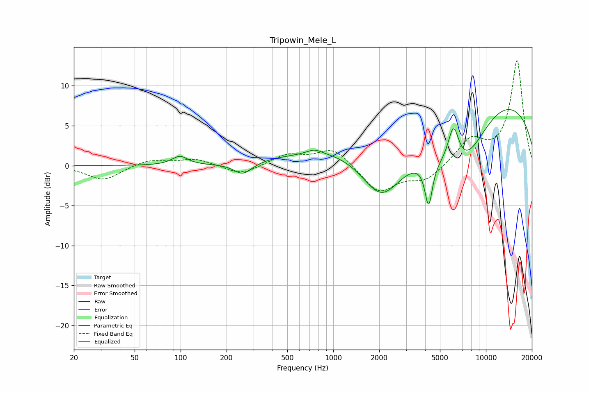

# Tripowin_Mele_L
See [usage instructions](https://github.com/jaakkopasanen/AutoEq#usage) for more options and info.

### Parametric EQs
Apply preamp of -7.1 dB when using parametric equalizer.

|   # | Type    |   Fc (Hz) |    Q |   Gain (dB) |
|-----|---------|-----------|------|-------------|
|   1 | Peaking |        99 | 2.81 |         1.1 |
|   2 | Peaking |       256 | 2.43 |        -1.5 |
|   3 | Peaking |       403 | 2.25 |         0.1 |
|   4 | Peaking |       752 | 3.01 |         0.6 |
|   5 | Peaking |      2067 | 1.01 |        -6.8 |
|   6 | Peaking |      3549 | 0.18 |         4.5 |
|   7 | Peaking |      4215 | 5.76 |        -5.5 |
|   8 | Peaking |      6130 | 3.67 |         5   |
|   9 | Peaking |      6995 | 0.45 |       -16.3 |
|  10 | Peaking |     10000 | 0.27 |        14.3 |

### Fixed Band EQs
When using fixed band (also called graphic) equalizer, apply preamp of **-13.2 dB** (if available) and set gains manually with these parameters.

|   # | Type    |   Fc (Hz) |    Q |   Gain (dB) |
|-----|---------|-----------|------|-------------|
|   1 | Peaking |        31 | 1.41 |        -1.8 |
|   2 | Peaking |        62 | 1.41 |         0.8 |
|   3 | Peaking |       125 | 1.41 |         0.8 |
|   4 | Peaking |       250 | 1.41 |        -1.2 |
|   5 | Peaking |       500 | 1.41 |         1.3 |
|   6 | Peaking |      1000 | 1.41 |         2.2 |
|   7 | Peaking |      2000 | 1.41 |        -3.4 |
|   8 | Peaking |      4000 | 1.41 |        -1.8 |
|   9 | Peaking |      8000 | 1.41 |         3.1 |
|  10 | Peaking |     16000 | 1.41 |        13.1 |

### Graphs

