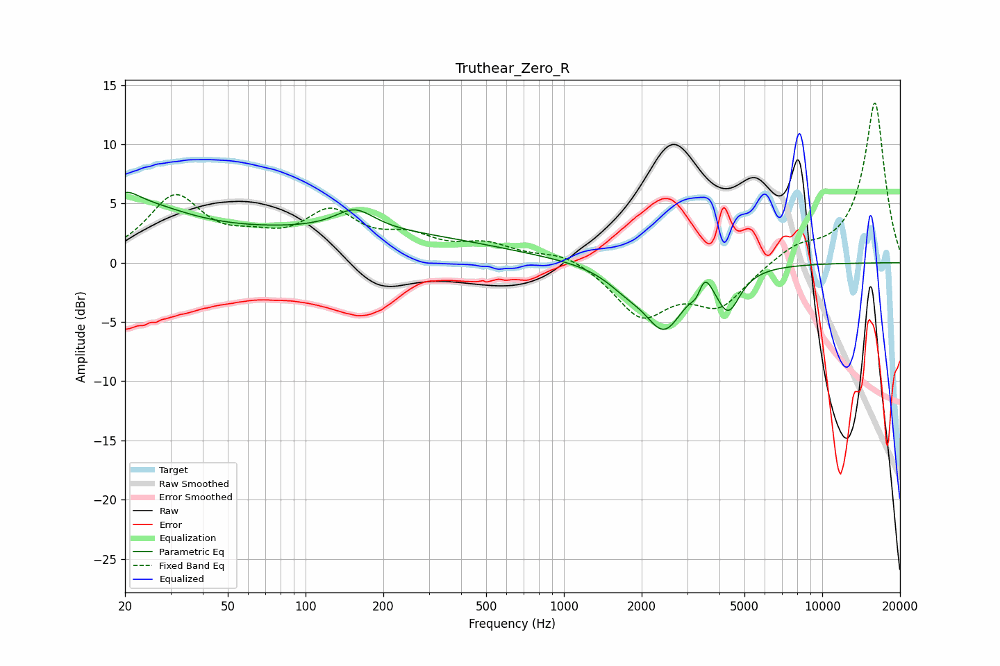

# Truthear_Zero_R
See [usage instructions](https://github.com/jaakkopasanen/AutoEq#usage) for more options and info.

### Parametric EQs
Apply preamp of -6.0 dB when using parametric equalizer.

|   # | Type    |   Fc (Hz) |    Q |   Gain (dB) |
|-----|---------|-----------|------|-------------|
|   1 | Peaking |        20 | 2.82 |         1.3 |
|   2 | Peaking |        21 | 0.68 |         4   |
|   3 | Peaking |       142 | 0.25 |         2.6 |
|   4 | Peaking |       155 | 1.89 |         1.8 |
|   5 | Peaking |      1743 | 1.73 |        -1.3 |
|   6 | Peaking |      2424 | 1.87 |         0.3 |
|   7 | Peaking |      2446 | 1.84 |        -5.4 |
|   8 | Peaking |      3288 | 5.97 |        -1.3 |
|   9 | Peaking |      3470 | 4.69 |         2.2 |
|  10 | Peaking |      4322 | 3.08 |        -3.4 |

### Fixed Band EQs
When using fixed band (also called graphic) equalizer, apply preamp of **-13.6 dB** (if available) and set gains manually with these parameters.

|   # | Type    |   Fc (Hz) |    Q |   Gain (dB) |
|-----|---------|-----------|------|-------------|
|   1 | Peaking |        31 | 1.41 |         5.4 |
|   2 | Peaking |        62 | 1.41 |         1.3 |
|   3 | Peaking |       125 | 1.41 |         3.8 |
|   4 | Peaking |       250 | 1.41 |         1.7 |
|   5 | Peaking |       500 | 1.41 |         1.3 |
|   6 | Peaking |      1000 | 1.41 |         1   |
|   7 | Peaking |      2000 | 1.41 |        -4.4 |
|   8 | Peaking |      4000 | 1.41 |        -3.4 |
|   9 | Peaking |      8000 | 1.41 |         1.2 |
|  10 | Peaking |     16000 | 1.41 |        13.6 |

### Graphs

