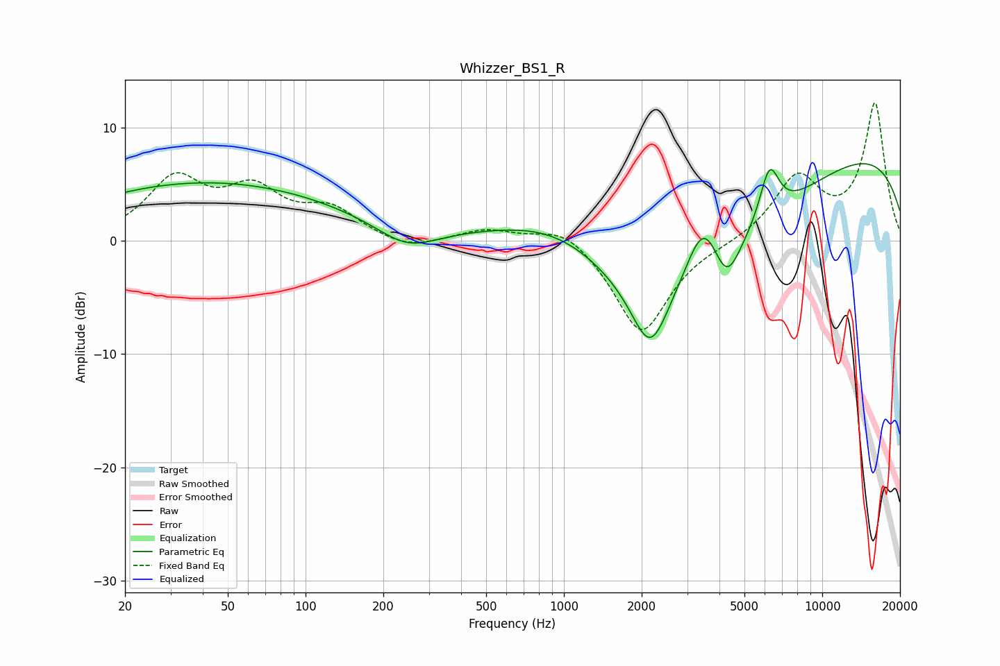

# Whizzer_BS1_R
See [usage instructions](https://github.com/jaakkopasanen/AutoEq#usage) for more options and info.

### Parametric EQs
Apply preamp of -6.9 dB when using parametric equalizer.

|   # | Type    |   Fc (Hz) |    Q |   Gain (dB) |
|-----|---------|-----------|------|-------------|
|   1 | Peaking |        41 | 0.27 |         4.2 |
|   2 | Peaking |        54 | 0.24 |         0.9 |
|   3 | Peaking |       247 | 1.2  |        -2.1 |
|   4 | Peaking |       986 | 0.51 |         6.2 |
|   5 | Peaking |      2157 | 1.96 |        -6.1 |
|   6 | Peaking |      2559 | 0.31 |       -11.2 |
|   7 | Peaking |      3471 | 2.06 |         5.4 |
|   8 | Peaking |      4259 | 2.69 |        -3.8 |
|   9 | Peaking |      6247 | 3.58 |         4.8 |
|  10 | Peaking |      9819 | 0.2  |         9.1 |

### Fixed Band EQs
When using fixed band (also called graphic) equalizer, apply preamp of **-12.2 dB** (if available) and set gains manually with these parameters.

|   # | Type    |   Fc (Hz) |    Q |   Gain (dB) |
|-----|---------|-----------|------|-------------|
|   1 | Peaking |        31 | 1.41 |         5.2 |
|   2 | Peaking |        62 | 1.41 |         4   |
|   3 | Peaking |       125 | 1.41 |         2.5 |
|   4 | Peaking |       250 | 1.41 |        -0.9 |
|   5 | Peaking |       500 | 1.41 |         1   |
|   6 | Peaking |      1000 | 1.41 |         1.6 |
|   7 | Peaking |      2000 | 1.41 |        -8.3 |
|   8 | Peaking |      4000 | 1.41 |        -0.2 |
|   9 | Peaking |      8000 | 1.41 |         5.5 |
|  10 | Peaking |     16000 | 1.41 |        12   |

### Graphs

