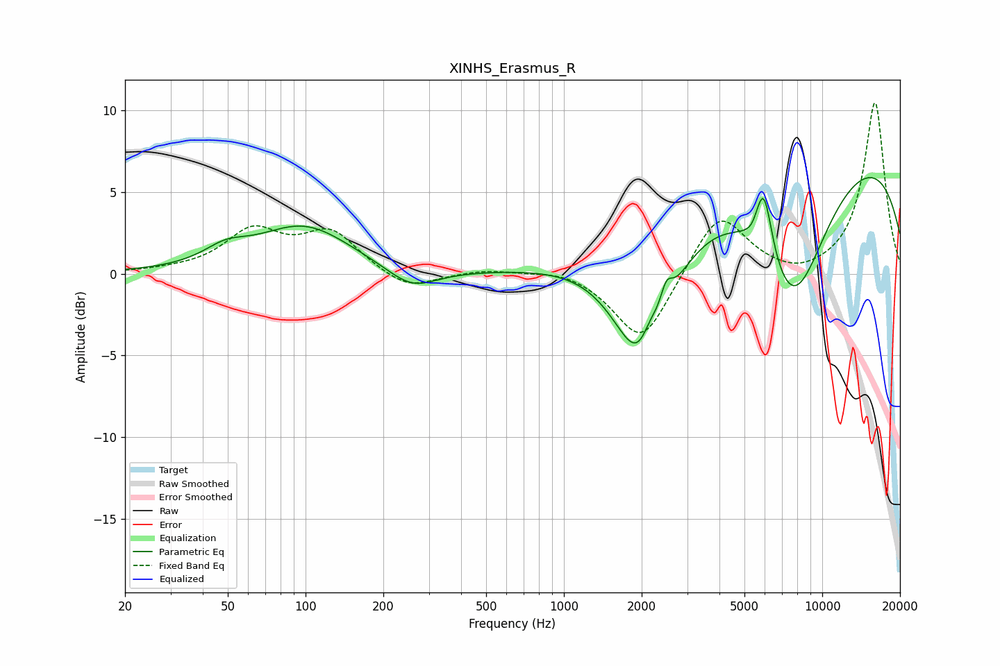

# XINHS_Erasmus_R
See [usage instructions](https://github.com/jaakkopasanen/AutoEq#usage) for more options and info.

### Parametric EQs
Apply preamp of -6.0 dB when using parametric equalizer.

|   # | Type    |   Fc (Hz) |    Q |   Gain (dB) |
|-----|---------|-----------|------|-------------|
|   1 | Peaking |        49 | 1.7  |         0.9 |
|   2 | Peaking |        99 | 0.78 |         2.9 |
|   3 | Peaking |       258 | 1.47 |        -1.3 |
|   4 | Peaking |      2029 | 1.23 |        -8.9 |
|   5 | Peaking |      2152 | 4.09 |         1.5 |
|   6 | Peaking |      2490 | 5.92 |         1.6 |
|   7 | Peaking |      5355 | 6    |        -0.3 |
|   8 | Peaking |      5936 | 4.17 |         4.3 |
|   9 | Peaking |      7674 | 0.92 |        -9.2 |
|  10 | Peaking |      9205 | 0.18 |         8.4 |

### Fixed Band EQs
When using fixed band (also called graphic) equalizer, apply preamp of **-10.5 dB** (if available) and set gains manually with these parameters.

|   # | Type    |   Fc (Hz) |    Q |   Gain (dB) |
|-----|---------|-----------|------|-------------|
|   1 | Peaking |        31 | 1.41 |         0.1 |
|   2 | Peaking |        62 | 1.41 |         2.5 |
|   3 | Peaking |       125 | 1.41 |         2.4 |
|   4 | Peaking |       250 | 1.41 |        -1.1 |
|   5 | Peaking |       500 | 1.41 |         0.3 |
|   6 | Peaking |      1000 | 1.41 |         0.4 |
|   7 | Peaking |      2000 | 1.41 |        -4.3 |
|   8 | Peaking |      4000 | 1.41 |         3.9 |
|   9 | Peaking |      8000 | 1.41 |        -0.4 |
|  10 | Peaking |     16000 | 1.41 |        10.5 |

### Graphs

