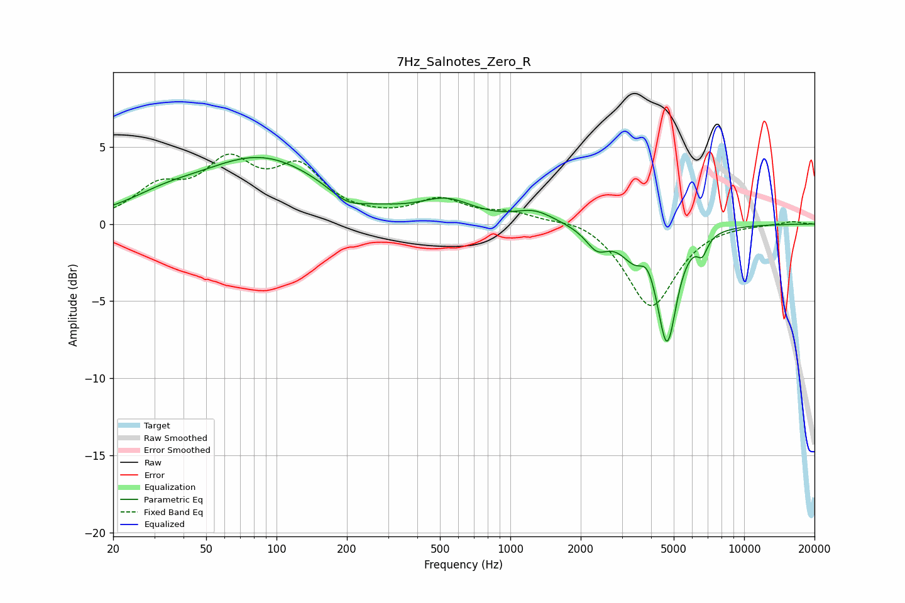

# 7Hz_Salnotes_Zero_R
See [usage instructions](https://github.com/jaakkopasanen/AutoEq#usage) for more options and info.

### Parametric EQs
Apply preamp of -4.4 dB when using parametric equalizer.

|   # | Type    |   Fc (Hz) |    Q |   Gain (dB) |
|-----|---------|-----------|------|-------------|
|   1 | Peaking |        33 | 0.91 |         0.8 |
|   2 | Peaking |        86 | 0.52 |         4.2 |
|   3 | Peaking |       201 | 1.9  |        -0.8 |
|   4 | Peaking |       535 | 1.25 |         1.3 |
|   5 | Peaking |      1271 | 1.72 |         0.8 |
|   6 | Peaking |      2347 | 2.94 |        -1.3 |
|   7 | Peaking |      3445 | 2.24 |        -1.8 |
|   8 | Peaking |      3837 | 4.1  |         1   |
|   9 | Peaking |      4680 | 3.36 |        -7.2 |
|  10 | Peaking |      6621 | 6    |        -1.1 |

### Fixed Band EQs
When using fixed band (also called graphic) equalizer, apply preamp of **-4.6 dB** (if available) and set gains manually with these parameters.

|   # | Type    |   Fc (Hz) |    Q |   Gain (dB) |
|-----|---------|-----------|------|-------------|
|   1 | Peaking |        31 | 1.41 |         2.1 |
|   2 | Peaking |        62 | 1.41 |         3.5 |
|   3 | Peaking |       125 | 1.41 |         3.2 |
|   4 | Peaking |       250 | 1.41 |         0.1 |
|   5 | Peaking |       500 | 1.41 |         1.5 |
|   6 | Peaking |      1000 | 1.41 |         0.6 |
|   7 | Peaking |      2000 | 1.41 |         0.5 |
|   8 | Peaking |      4000 | 1.41 |        -5.4 |
|   9 | Peaking |      8000 | 1.41 |         0   |
|  10 | Peaking |     16000 | 1.41 |         0.2 |

### Graphs

