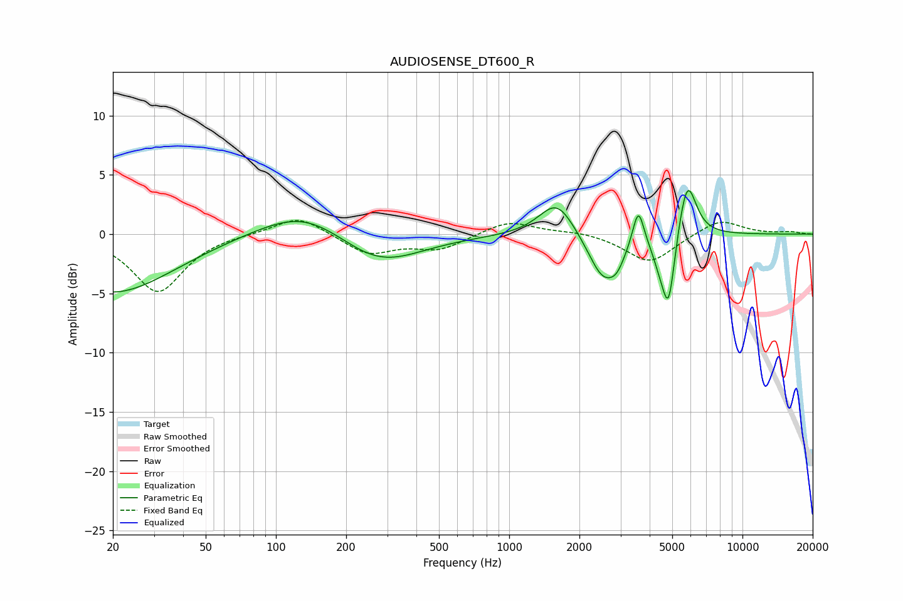

# AUDIOSENSE_DT600_R
See [usage instructions](https://github.com/jaakkopasanen/AutoEq#usage) for more options and info.

### Parametric EQs
Apply preamp of -3.8 dB when using parametric equalizer.

|   # | Type    |   Fc (Hz) |    Q |   Gain (dB) |
|-----|---------|-----------|------|-------------|
|   1 | Peaking |        20 | 0.55 |        -5   |
|   2 | Peaking |       133 | 0.74 |         2.5 |
|   3 | Peaking |       274 | 0.78 |        -2.8 |
|   4 | Peaking |      1601 | 1.87 |         3   |
|   5 | Peaking |      2517 | 2.2  |        -3.7 |
|   6 | Peaking |      2897 | 3.88 |        -1.3 |
|   7 | Peaking |      3577 | 5.83 |         3.3 |
|   8 | Peaking |      4460 | 4.01 |        -1.9 |
|   9 | Peaking |      4831 | 5.34 |        -5.5 |
|  10 | Peaking |      5801 | 3.65 |         5   |

### Fixed Band EQs
When using fixed band (also called graphic) equalizer, apply preamp of **-1.2 dB** (if available) and set gains manually with these parameters.

|   # | Type    |   Fc (Hz) |    Q |   Gain (dB) |
|-----|---------|-----------|------|-------------|
|   1 | Peaking |        31 | 1.41 |        -4.9 |
|   2 | Peaking |        62 | 1.41 |         0.1 |
|   3 | Peaking |       125 | 1.41 |         1.6 |
|   4 | Peaking |       250 | 1.41 |        -1.7 |
|   5 | Peaking |       500 | 1.41 |        -1.2 |
|   6 | Peaking |      1000 | 1.41 |         1.2 |
|   7 | Peaking |      2000 | 1.41 |         0.3 |
|   8 | Peaking |      4000 | 1.41 |        -2.4 |
|   9 | Peaking |      8000 | 1.41 |         1.3 |
|  10 | Peaking |     16000 | 1.41 |         0.2 |

### Graphs

