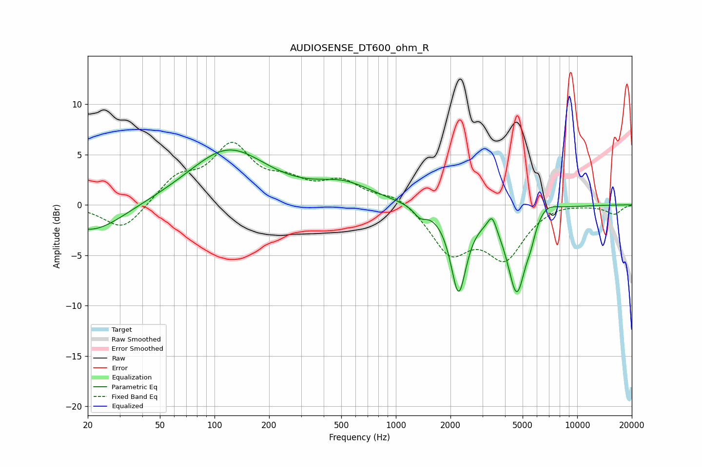

# AUDIOSENSE_DT600_ohm_R
See [usage instructions](https://github.com/jaakkopasanen/AutoEq#usage) for more options and info.

### Parametric EQs
Apply preamp of -5.5 dB when using parametric equalizer.

|   # | Type    |   Fc (Hz) |    Q |   Gain (dB) |
|-----|---------|-----------|------|-------------|
|   1 | Peaking |        20 | 5.52 |         0   |
|   2 | Peaking |        21 | 0.81 |        -2.8 |
|   3 | Peaking |       119 | 0.66 |         5.5 |
|   4 | Peaking |       519 | 0.89 |         1.8 |
|   5 | Peaking |      1360 | 4.15 |        -0.9 |
|   6 | Peaking |      2217 | 3.23 |        -8.3 |
|   7 | Peaking |      3394 | 6    |         1.6 |
|   8 | Peaking |      4645 | 2.7  |        -8.6 |
|   9 | Peaking |      5540 | 5.73 |        -1   |
|  10 | Peaking |      6658 | 2.18 |         1.2 |

### Fixed Band EQs
When using fixed band (also called graphic) equalizer, apply preamp of **-6.3 dB** (if available) and set gains manually with these parameters.

|   # | Type    |   Fc (Hz) |    Q |   Gain (dB) |
|-----|---------|-----------|------|-------------|
|   1 | Peaking |        31 | 1.41 |        -2.7 |
|   2 | Peaking |        62 | 1.41 |         2.5 |
|   3 | Peaking |       125 | 1.41 |         5.5 |
|   4 | Peaking |       250 | 1.41 |         1.8 |
|   5 | Peaking |       500 | 1.41 |         2.1 |
|   6 | Peaking |      1000 | 1.41 |         1.1 |
|   7 | Peaking |      2000 | 1.41 |        -4.5 |
|   8 | Peaking |      4000 | 1.41 |        -4.9 |
|   9 | Peaking |      8000 | 1.41 |         0.3 |
|  10 | Peaking |     16000 | 1.41 |        -0.9 |

### Graphs

