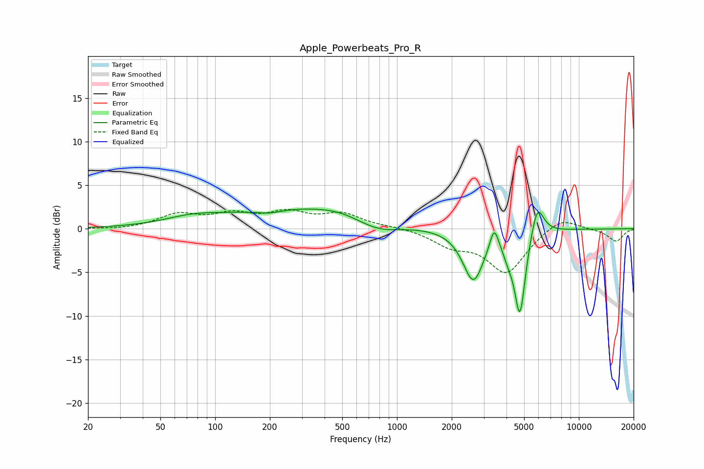

# Apple_Powerbeats_Pro_R
See [usage instructions](https://github.com/jaakkopasanen/AutoEq#usage) for more options and info.

### Parametric EQs
Apply preamp of -2.4 dB when using parametric equalizer.

|   # | Type    |   Fc (Hz) |    Q |   Gain (dB) |
|-----|---------|-----------|------|-------------|
|   1 | Peaking |        76 | 0.88 |         0.9 |
|   2 | Peaking |       200 | 2.02 |        -0.4 |
|   3 | Peaking |       321 | 0.35 |         2.4 |
|   4 | Peaking |       485 | 1.18 |         0.4 |
|   5 | Peaking |       784 | 1.07 |        -1.5 |
|   6 | Peaking |      2628 | 2.48 |        -5.9 |
|   7 | Peaking |      3422 | 6    |         2.6 |
|   8 | Peaking |      4080 | 5.15 |        -1.2 |
|   9 | Peaking |      4741 | 4.51 |        -9.7 |
|  10 | Peaking |      5908 | 3.92 |         3.8 |

### Fixed Band EQs
When using fixed band (also called graphic) equalizer, apply preamp of **-2.3 dB** (if available) and set gains manually with these parameters.

|   # | Type    |   Fc (Hz) |    Q |   Gain (dB) |
|-----|---------|-----------|------|-------------|
|   1 | Peaking |        31 | 1.41 |        -0.1 |
|   2 | Peaking |        62 | 1.41 |         1.5 |
|   3 | Peaking |       125 | 1.41 |         1.4 |
|   4 | Peaking |       250 | 1.41 |         1.6 |
|   5 | Peaking |       500 | 1.41 |         1.6 |
|   6 | Peaking |      1000 | 1.41 |         0.2 |
|   7 | Peaking |      2000 | 1.41 |        -1.7 |
|   8 | Peaking |      4000 | 1.41 |        -5   |
|   9 | Peaking |      8000 | 1.41 |         1.5 |
|  10 | Peaking |     16000 | 1.41 |        -1.4 |

### Graphs

