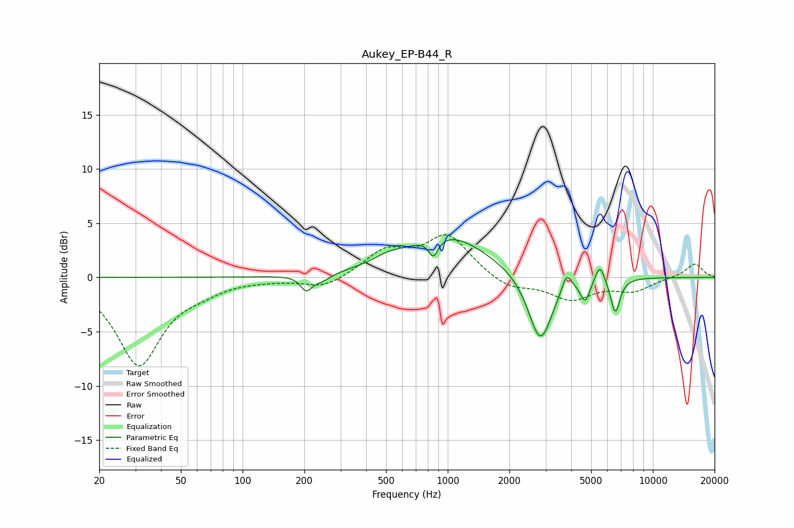

# Aukey_EP-B44_R
See [usage instructions](https://github.com/jaakkopasanen/AutoEq#usage) for more options and info.

### Parametric EQs
Apply preamp of -3.6 dB when using parametric equalizer.

|   # | Type    |   Fc (Hz) |    Q |   Gain (dB) |
|-----|---------|-----------|------|-------------|
|   1 | Peaking |       204 | 5.19 |        -1.3 |
|   2 | Peaking |       244 | 3.17 |        -0.6 |
|   3 | Peaking |       511 | 2.1  |         0.5 |
|   4 | Peaking |       851 | 6    |        -1.7 |
|   5 | Peaking |       989 | 0.71 |         3.9 |
|   6 | Peaking |      2827 | 2.42 |        -6.4 |
|   7 | Peaking |      3799 | 6    |         1.7 |
|   8 | Peaking |      4681 | 6    |        -2   |
|   9 | Peaking |      5519 | 6    |         1.7 |
|  10 | Peaking |      6560 | 6    |        -3.2 |

### Fixed Band EQs
When using fixed band (also called graphic) equalizer, apply preamp of **-4.0 dB** (if available) and set gains manually with these parameters.

|   # | Type    |   Fc (Hz) |    Q |   Gain (dB) |
|-----|---------|-----------|------|-------------|
|   1 | Peaking |        31 | 1.41 |        -8   |
|   2 | Peaking |        62 | 1.41 |        -0.8 |
|   3 | Peaking |       125 | 1.41 |        -0.1 |
|   4 | Peaking |       250 | 1.41 |        -1   |
|   5 | Peaking |       500 | 1.41 |         2.3 |
|   6 | Peaking |      1000 | 1.41 |         3.8 |
|   7 | Peaking |      2000 | 1.41 |        -1.1 |
|   8 | Peaking |      4000 | 1.41 |        -1.9 |
|   9 | Peaking |      8000 | 1.41 |        -1.1 |
|  10 | Peaking |     16000 | 1.41 |         1.3 |

### Graphs

