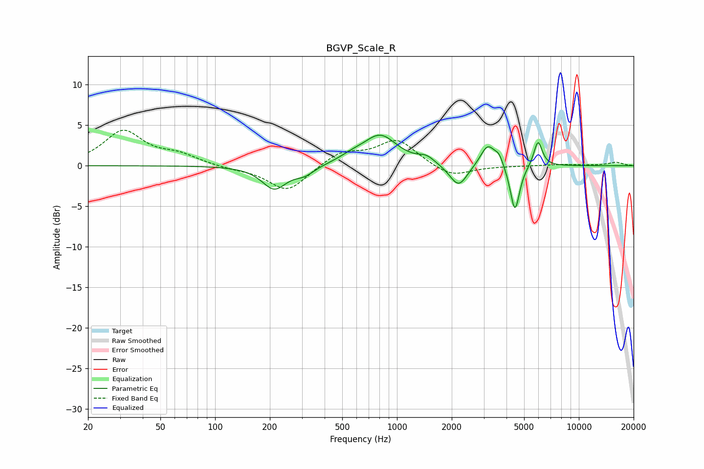

# BGVP_Scale_R
See [usage instructions](https://github.com/jaakkopasanen/AutoEq#usage) for more options and info.

### Parametric EQs
Apply preamp of -3.9 dB when using parametric equalizer.

|   # | Type    |   Fc (Hz) |    Q |   Gain (dB) |
|-----|---------|-----------|------|-------------|
|   1 | Peaking |       211 | 2.11 |        -2.8 |
|   2 | Peaking |       311 | 2.55 |        -1   |
|   3 | Peaking |       563 | 2.01 |         0.6 |
|   4 | Peaking |       808 | 1.52 |         3.6 |
|   5 | Peaking |      1452 | 3.18 |         0.8 |
|   6 | Peaking |      2181 | 2.89 |        -2.8 |
|   7 | Peaking |      3154 | 3.5  |         2.7 |
|   8 | Peaking |      3639 | 5.99 |         1.1 |
|   9 | Peaking |      4452 | 5.48 |        -5.8 |
|  10 | Peaking |      5963 | 5.98 |         3.2 |

### Fixed Band EQs
When using fixed band (also called graphic) equalizer, apply preamp of **-4.5 dB** (if available) and set gains manually with these parameters.

|   # | Type    |   Fc (Hz) |    Q |   Gain (dB) |
|-----|---------|-----------|------|-------------|
|   1 | Peaking |        31 | 1.41 |         4.2 |
|   2 | Peaking |        62 | 1.41 |         1.2 |
|   3 | Peaking |       125 | 1.41 |        -0.3 |
|   4 | Peaking |       250 | 1.41 |        -3.2 |
|   5 | Peaking |       500 | 1.41 |         1.7 |
|   6 | Peaking |      1000 | 1.41 |         3.2 |
|   7 | Peaking |      2000 | 1.41 |        -1.5 |
|   8 | Peaking |      4000 | 1.41 |        -0   |
|   9 | Peaking |      8000 | 1.41 |         0.1 |
|  10 | Peaking |     16000 | 1.41 |         0.4 |

### Graphs

