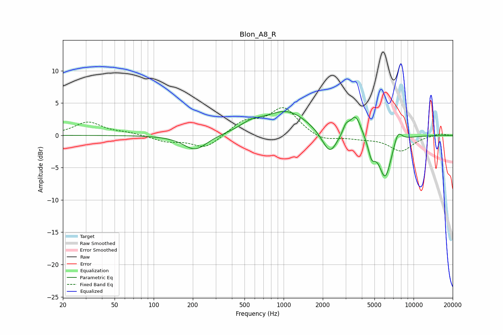

# Blon_A8_R
See [usage instructions](https://github.com/jaakkopasanen/AutoEq#usage) for more options and info.

### Parametric EQs
Apply preamp of -3.8 dB when using parametric equalizer.

|   # | Type    |   Fc (Hz) |    Q |   Gain (dB) |
|-----|---------|-----------|------|-------------|
|   1 | Peaking |       209 | 1.56 |        -2.4 |
|   2 | Peaking |       562 | 1.61 |         1.1 |
|   3 | Peaking |      1059 | 0.85 |         3.7 |
|   4 | Peaking |      2178 | 2.03 |        -0.7 |
|   5 | Peaking |      2275 | 2.58 |        -3   |
|   6 | Peaking |      3016 | 6    |         1.2 |
|   7 | Peaking |      3576 | 3.14 |         3.4 |
|   8 | Peaking |      4754 | 5.18 |        -2.6 |
|   9 | Peaking |      6047 | 2.72 |        -6.7 |
|  10 | Peaking |      7567 | 4.08 |         2.1 |

### Fixed Band EQs
When using fixed band (also called graphic) equalizer, apply preamp of **-4.4 dB** (if available) and set gains manually with these parameters.

|   # | Type    |   Fc (Hz) |    Q |   Gain (dB) |
|-----|---------|-----------|------|-------------|
|   1 | Peaking |        31 | 1.41 |         2   |
|   2 | Peaking |        62 | 1.41 |         0.4 |
|   3 | Peaking |       125 | 1.41 |        -0.9 |
|   4 | Peaking |       250 | 1.41 |        -2   |
|   5 | Peaking |       500 | 1.41 |         2   |
|   6 | Peaking |      1000 | 1.41 |         4.2 |
|   7 | Peaking |      2000 | 1.41 |        -1   |
|   8 | Peaking |      4000 | 1.41 |        -0.4 |
|   9 | Peaking |      8000 | 1.41 |        -2.4 |
|  10 | Peaking |     16000 | 1.41 |         0.3 |

### Graphs

