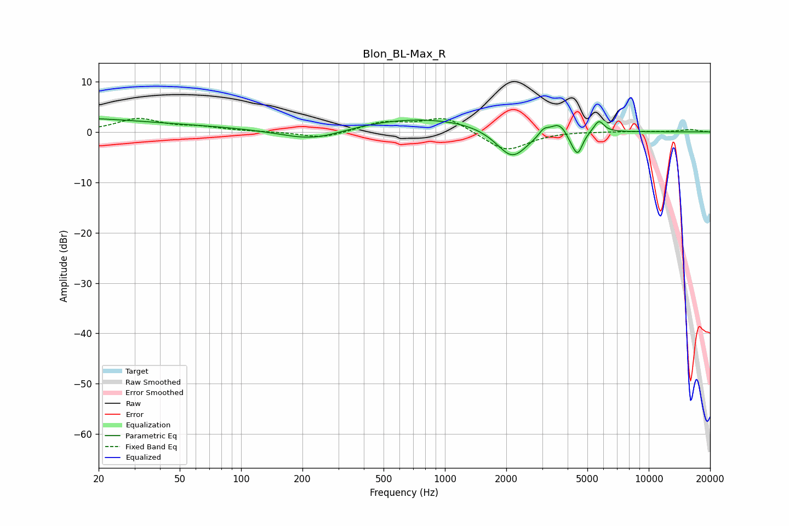

# Blon_BL-Max_R
See [usage instructions](https://github.com/jaakkopasanen/AutoEq#usage) for more options and info.

### Parametric EQs
Apply preamp of -2.7 dB when using parametric equalizer.

|   # | Type    |   Fc (Hz) |    Q |   Gain (dB) |
|-----|---------|-----------|------|-------------|
|   1 | Peaking |        34 | 0.18 |         3.9 |
|   2 | Peaking |        88 | 0.26 |        -2.4 |
|   3 | Peaking |       227 | 0.89 |        -2.4 |
|   4 | Peaking |       692 | 0.35 |         3.1 |
|   5 | Peaking |      2137 | 1.77 |        -6.3 |
|   6 | Peaking |      3054 | 5.97 |         1.2 |
|   7 | Peaking |      3638 | 3.28 |         2.4 |
|   8 | Peaking |      4187 | 4.85 |        -1.6 |
|   9 | Peaking |      4495 | 5.8  |        -4   |
|  10 | Peaking |      5693 | 5.63 |         2.4 |

### Fixed Band EQs
When using fixed band (also called graphic) equalizer, apply preamp of **-2.8 dB** (if available) and set gains manually with these parameters.

|   # | Type    |   Fc (Hz) |    Q |   Gain (dB) |
|-----|---------|-----------|------|-------------|
|   1 | Peaking |        31 | 1.41 |         2.5 |
|   2 | Peaking |        62 | 1.41 |         0.8 |
|   3 | Peaking |       125 | 1.41 |         0   |
|   4 | Peaking |       250 | 1.41 |        -1.3 |
|   5 | Peaking |       500 | 1.41 |         1.8 |
|   6 | Peaking |      1000 | 1.41 |         3   |
|   7 | Peaking |      2000 | 1.41 |        -4   |
|   8 | Peaking |      4000 | 1.41 |         0.1 |
|   9 | Peaking |      8000 | 1.41 |         0.1 |
|  10 | Peaking |     16000 | 1.41 |         0.5 |

### Graphs

