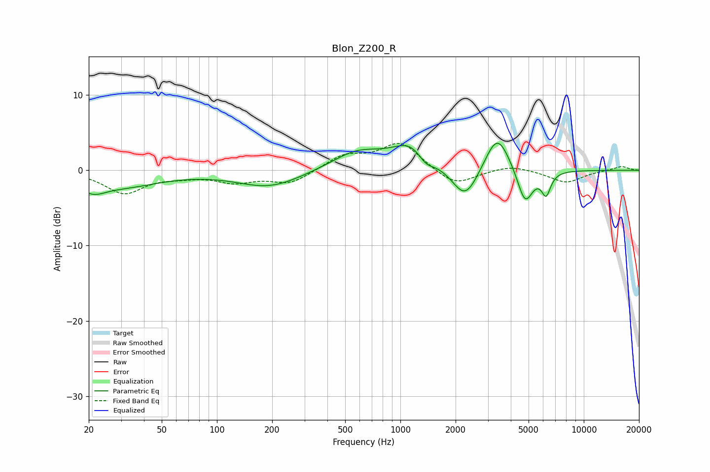

# Blon_Z200_R
See [usage instructions](https://github.com/jaakkopasanen/AutoEq#usage) for more options and info.

### Parametric EQs
Apply preamp of -3.7 dB when using parametric equalizer.

|   # | Type    |   Fc (Hz) |    Q |   Gain (dB) |
|-----|---------|-----------|------|-------------|
|   1 | Peaking |        21 | 2.07 |        -1.6 |
|   2 | Peaking |        30 | 0.66 |        -2   |
|   3 | Peaking |       193 | 0.81 |        -2.2 |
|   4 | Peaking |       583 | 1    |         2.5 |
|   5 | Peaking |      1155 | 1.36 |         3.3 |
|   6 | Peaking |      1375 | 3.12 |        -1.5 |
|   7 | Peaking |      2261 | 1.96 |        -4.5 |
|   8 | Peaking |      3376 | 2.11 |         5.3 |
|   9 | Peaking |      4786 | 3.27 |        -4.8 |
|  10 | Peaking |      6234 | 5.59 |        -2.9 |

### Fixed Band EQs
When using fixed band (also called graphic) equalizer, apply preamp of **-3.7 dB** (if available) and set gains manually with these parameters.

|   # | Type    |   Fc (Hz) |    Q |   Gain (dB) |
|-----|---------|-----------|------|-------------|
|   1 | Peaking |        31 | 1.41 |        -3   |
|   2 | Peaking |        62 | 1.41 |        -0.6 |
|   3 | Peaking |       125 | 1.41 |        -1.4 |
|   4 | Peaking |       250 | 1.41 |        -1.7 |
|   5 | Peaking |       500 | 1.41 |         1.9 |
|   6 | Peaking |      1000 | 1.41 |         3.6 |
|   7 | Peaking |      2000 | 1.41 |        -2.2 |
|   8 | Peaking |      4000 | 1.41 |         0.7 |
|   9 | Peaking |      8000 | 1.41 |        -1.6 |
|  10 | Peaking |     16000 | 1.41 |         0.6 |

### Graphs

