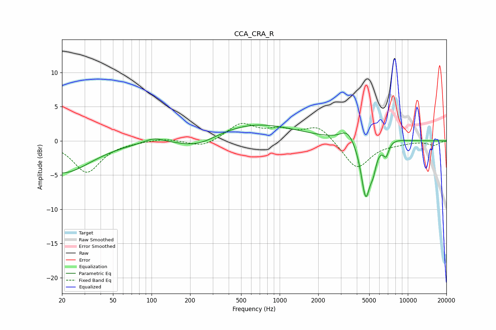

# CCA_CRA_R
See [usage instructions](https://github.com/jaakkopasanen/AutoEq#usage) for more options and info.

### Parametric EQs
Apply preamp of -2.4 dB when using parametric equalizer.

|   # | Type    |   Fc (Hz) |    Q |   Gain (dB) |
|-----|---------|-----------|------|-------------|
|   1 | Peaking |        20 | 0.64 |        -4.7 |
|   2 | Peaking |       105 | 1.87 |         0.8 |
|   3 | Peaking |       230 | 0.95 |        -1.5 |
|   4 | Peaking |       638 | 0.44 |         2.5 |
|   5 | Peaking |      3389 | 2.62 |         1.7 |
|   6 | Peaking |      4693 | 3.79 |        -8.3 |
|   7 | Peaking |      5371 | 5.98 |        -2.1 |
|   8 | Peaking |      6509 | 2.69 |        -0.3 |
|   9 | Peaking |      6768 | 6    |        -1.8 |
|  10 | Peaking |      7192 | 1.54 |         0.7 |

### Fixed Band EQs
When using fixed band (also called graphic) equalizer, apply preamp of **-2.6 dB** (if available) and set gains manually with these parameters.

|   # | Type    |   Fc (Hz) |    Q |   Gain (dB) |
|-----|---------|-----------|------|-------------|
|   1 | Peaking |        31 | 1.41 |        -4.6 |
|   2 | Peaking |        62 | 1.41 |        -0.1 |
|   3 | Peaking |       125 | 1.41 |         0.4 |
|   4 | Peaking |       250 | 1.41 |        -1   |
|   5 | Peaking |       500 | 1.41 |         2.4 |
|   6 | Peaking |      1000 | 1.41 |         1.3 |
|   7 | Peaking |      2000 | 1.41 |         2.2 |
|   8 | Peaking |      4000 | 1.41 |        -4.1 |
|   9 | Peaking |      8000 | 1.41 |        -0.3 |
|  10 | Peaking |     16000 | 1.41 |        -0.6 |

### Graphs

