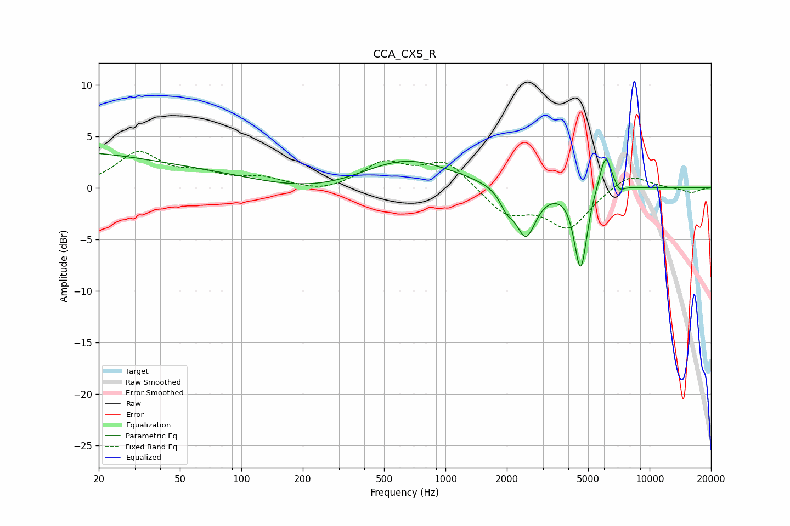

# CCA_CXS_R
See [usage instructions](https://github.com/jaakkopasanen/AutoEq#usage) for more options and info.

### Parametric EQs
Apply preamp of -3.4 dB when using parametric equalizer.

|   # | Type    |   Fc (Hz) |    Q |   Gain (dB) |
|-----|---------|-----------|------|-------------|
|   1 | Peaking |        28 | 0.18 |         4.3 |
|   2 | Peaking |       117 | 0.21 |        -2.2 |
|   3 | Peaking |       617 | 0.6  |         3.4 |
|   4 | Peaking |      1992 | 4.37 |        -1.4 |
|   5 | Peaking |      2476 | 2.86 |        -4.7 |
|   6 | Peaking |      4246 | 6    |        -0.4 |
|   7 | Peaking |      4576 | 4.93 |        -6.9 |
|   8 | Peaking |      4797 | 5.98 |        -1.1 |
|   9 | Peaking |      6089 | 4.53 |         3.7 |
|  10 | Peaking |      7108 | 6    |        -0.7 |

### Fixed Band EQs
When using fixed band (also called graphic) equalizer, apply preamp of **-3.6 dB** (if available) and set gains manually with these parameters.

|   # | Type    |   Fc (Hz) |    Q |   Gain (dB) |
|-----|---------|-----------|------|-------------|
|   1 | Peaking |        31 | 1.41 |         3.3 |
|   2 | Peaking |        62 | 1.41 |         1.1 |
|   3 | Peaking |       125 | 1.41 |         0.9 |
|   4 | Peaking |       250 | 1.41 |        -0.5 |
|   5 | Peaking |       500 | 1.41 |         2.3 |
|   6 | Peaking |      1000 | 1.41 |         2.6 |
|   7 | Peaking |      2000 | 1.41 |        -2.5 |
|   8 | Peaking |      4000 | 1.41 |        -3.8 |
|   9 | Peaking |      8000 | 1.41 |         1.5 |
|  10 | Peaking |     16000 | 1.41 |        -0.5 |

### Graphs

