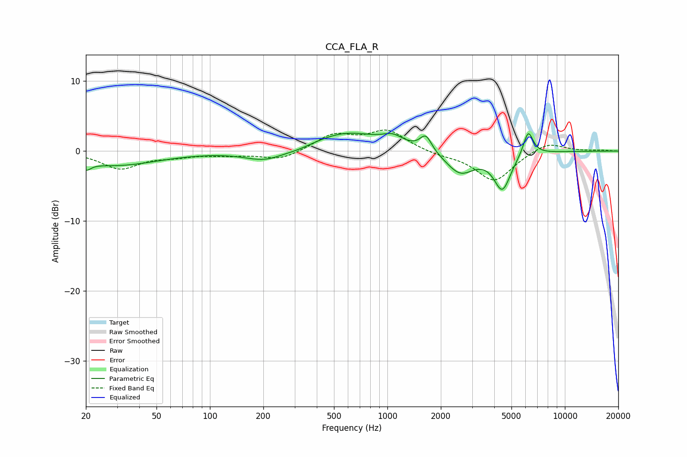

# CCA_FLA_R
See [usage instructions](https://github.com/jaakkopasanen/AutoEq#usage) for more options and info.

### Parametric EQs
Apply preamp of -2.7 dB when using parametric equalizer.

|   # | Type    |   Fc (Hz) |    Q |   Gain (dB) |
|-----|---------|-----------|------|-------------|
|   1 | Peaking |        20 | 5.21 |        -1.1 |
|   2 | Peaking |        29 | 0.58 |        -2   |
|   3 | Peaking |       204 | 1.25 |        -1.5 |
|   4 | Peaking |       314 | 2.04 |        -0.3 |
|   5 | Peaking |       590 | 0.78 |         2.6 |
|   6 | Peaking |      1074 | 2.34 |         1.3 |
|   7 | Peaking |      1647 | 4.3  |         2.3 |
|   8 | Peaking |      2571 | 1.77 |        -3.2 |
|   9 | Peaking |      4444 | 2.96 |        -5.2 |
|  10 | Peaking |      6217 | 4.94 |         3.5 |

### Fixed Band EQs
When using fixed band (also called graphic) equalizer, apply preamp of **-3.1 dB** (if available) and set gains manually with these parameters.

|   # | Type    |   Fc (Hz) |    Q |   Gain (dB) |
|-----|---------|-----------|------|-------------|
|   1 | Peaking |        31 | 1.41 |        -2.4 |
|   2 | Peaking |        62 | 1.41 |        -0.6 |
|   3 | Peaking |       125 | 1.41 |        -0.5 |
|   4 | Peaking |       250 | 1.41 |        -1.3 |
|   5 | Peaking |       500 | 1.41 |         2.3 |
|   6 | Peaking |      1000 | 1.41 |         2.8 |
|   7 | Peaking |      2000 | 1.41 |        -0.5 |
|   8 | Peaking |      4000 | 1.41 |        -4.3 |
|   9 | Peaking |      8000 | 1.41 |         1.4 |
|  10 | Peaking |     16000 | 1.41 |         0.1 |

### Graphs

