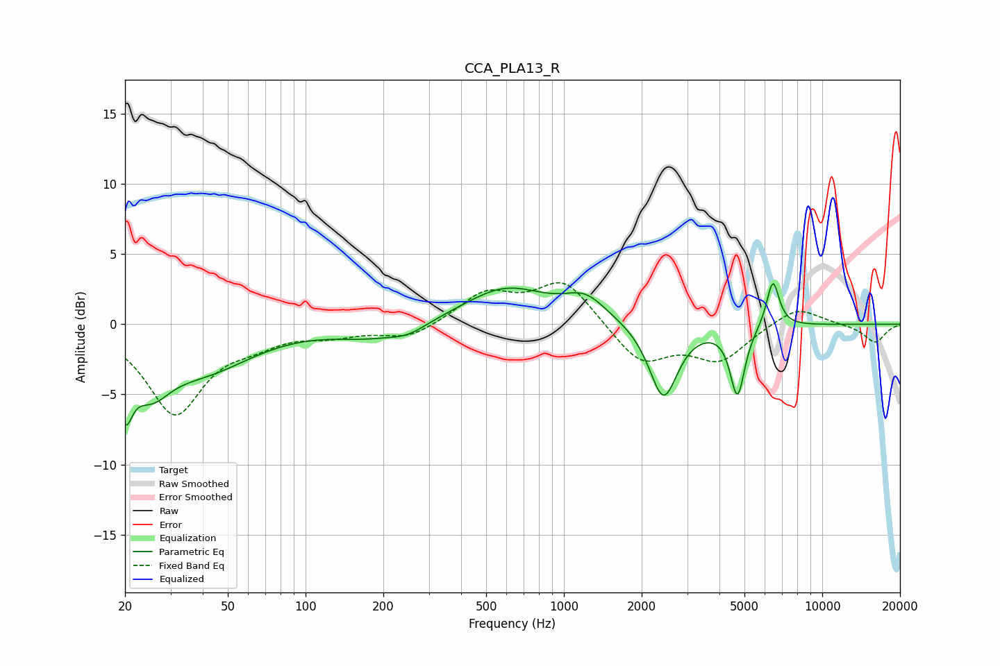

# CCA_PLA13_R
See [usage instructions](https://github.com/jaakkopasanen/AutoEq#usage) for more options and info.

### Parametric EQs
Apply preamp of -3.0 dB when using parametric equalizer.

|   # | Type    |   Fc (Hz) |    Q |   Gain (dB) |
|-----|---------|-----------|------|-------------|
|   1 | Peaking |        20 | 5.11 |        -4   |
|   2 | Peaking |        25 | 1.82 |        -3.1 |
|   3 | Peaking |        40 | 0.74 |        -3   |
|   4 | Peaking |       171 | 1.07 |        -0.8 |
|   5 | Peaking |       248 | 1.8  |        -0.8 |
|   6 | Peaking |       596 | 0.88 |         2.6 |
|   7 | Peaking |      1213 | 1.74 |         1.6 |
|   8 | Peaking |      2427 | 2.58 |        -5.4 |
|   9 | Peaking |      4697 | 4.99 |        -4.9 |
|  10 | Peaking |      6440 | 5.6  |         3.4 |

### Fixed Band EQs
When using fixed band (also called graphic) equalizer, apply preamp of **-3.1 dB** (if available) and set gains manually with these parameters.

|   # | Type    |   Fc (Hz) |    Q |   Gain (dB) |
|-----|---------|-----------|------|-------------|
|   1 | Peaking |        31 | 1.41 |        -6.3 |
|   2 | Peaking |        62 | 1.41 |        -0.9 |
|   3 | Peaking |       125 | 1.41 |        -0.6 |
|   4 | Peaking |       250 | 1.41 |        -1   |
|   5 | Peaking |       500 | 1.41 |         2.2 |
|   6 | Peaking |      1000 | 1.41 |         3.1 |
|   7 | Peaking |      2000 | 1.41 |        -2.8 |
|   8 | Peaking |      4000 | 1.41 |        -2.5 |
|   9 | Peaking |      8000 | 1.41 |         1.4 |
|  10 | Peaking |     16000 | 1.41 |        -1.3 |

### Graphs

