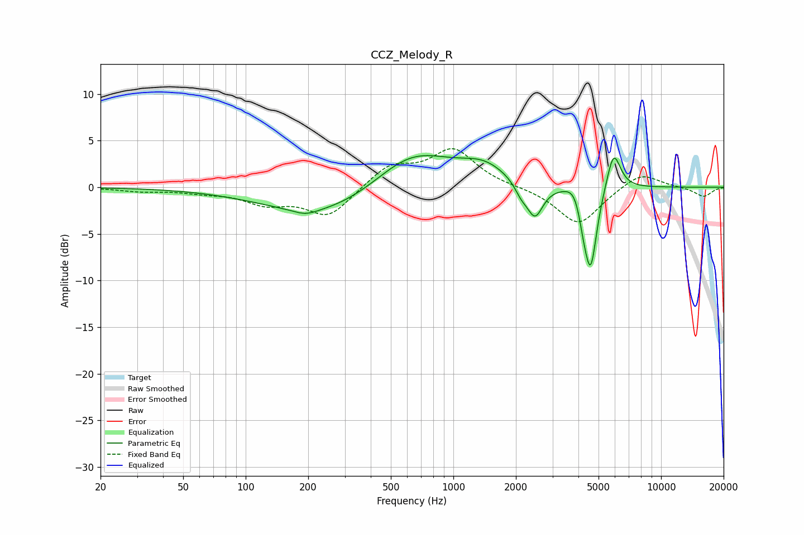

# CCZ_Melody_R
See [usage instructions](https://github.com/jaakkopasanen/AutoEq#usage) for more options and info.

### Parametric EQs
Apply preamp of -3.5 dB when using parametric equalizer.

|   # | Type    |   Fc (Hz) |    Q |   Gain (dB) |
|-----|---------|-----------|------|-------------|
|   1 | Peaking |       194 | 2.48 |        -0.6 |
|   2 | Peaking |       263 | 0.46 |        -3.5 |
|   3 | Peaking |       624 | 0.71 |         4.8 |
|   4 | Peaking |      1406 | 1.27 |         1.8 |
|   5 | Peaking |      2117 | 4.49 |        -1.1 |
|   6 | Peaking |      2470 | 3.6  |        -3.6 |
|   7 | Peaking |      3852 | 3.59 |         1.4 |
|   8 | Peaking |      4231 | 6    |        -1.9 |
|   9 | Peaking |      4583 | 4.59 |        -8.6 |
|  10 | Peaking |      5907 | 4.17 |         4.3 |

### Fixed Band EQs
When using fixed band (also called graphic) equalizer, apply preamp of **-4.2 dB** (if available) and set gains manually with these parameters.

|   # | Type    |   Fc (Hz) |    Q |   Gain (dB) |
|-----|---------|-----------|------|-------------|
|   1 | Peaking |        31 | 1.41 |        -0.4 |
|   2 | Peaking |        62 | 1.41 |        -0.4 |
|   3 | Peaking |       125 | 1.41 |        -1.6 |
|   4 | Peaking |       250 | 1.41 |        -3.1 |
|   5 | Peaking |       500 | 1.41 |         2.3 |
|   6 | Peaking |      1000 | 1.41 |         3.9 |
|   7 | Peaking |      2000 | 1.41 |         0   |
|   8 | Peaking |      4000 | 1.41 |        -4.1 |
|   9 | Peaking |      8000 | 1.41 |         1.7 |
|  10 | Peaking |     16000 | 1.41 |        -1   |

### Graphs

