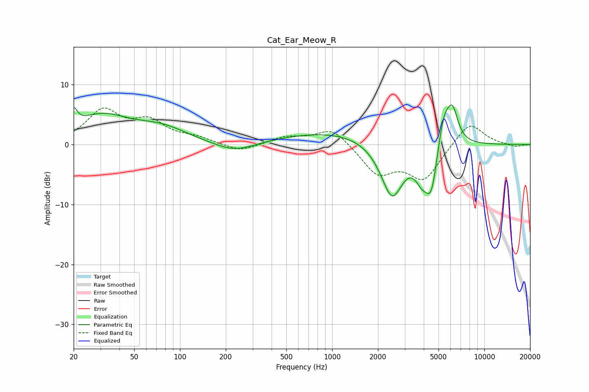

# Cat_Ear_Meow_R
See [usage instructions](https://github.com/jaakkopasanen/AutoEq#usage) for more options and info.

### Parametric EQs
Apply preamp of -6.7 dB when using parametric equalizer.

|   # | Type    |   Fc (Hz) |    Q |   Gain (dB) |
|-----|---------|-----------|------|-------------|
|   1 | Peaking |        20 | 6    |         2.7 |
|   2 | Peaking |        30 | 0.76 |         4.5 |
|   3 | Peaking |        76 | 0.82 |         2.3 |
|   4 | Peaking |       228 | 1.06 |        -1.7 |
|   5 | Peaking |      1164 | 0.36 |         2.3 |
|   6 | Peaking |      2473 | 1.82 |        -9.7 |
|   7 | Peaking |      3865 | 3.32 |        -3.1 |
|   8 | Peaking |      4493 | 3.16 |        -8.4 |
|   9 | Peaking |      5414 | 3.03 |         6.3 |
|  10 | Peaking |      6196 | 3.84 |         4.9 |

### Fixed Band EQs
When using fixed band (also called graphic) equalizer, apply preamp of **-6.2 dB** (if available) and set gains manually with these parameters.

|   # | Type    |   Fc (Hz) |    Q |   Gain (dB) |
|-----|---------|-----------|------|-------------|
|   1 | Peaking |        31 | 1.41 |         5.4 |
|   2 | Peaking |        62 | 1.41 |         3.4 |
|   3 | Peaking |       125 | 1.41 |         1   |
|   4 | Peaking |       250 | 1.41 |        -1.3 |
|   5 | Peaking |       500 | 1.41 |         1.2 |
|   6 | Peaking |      1000 | 1.41 |         2.9 |
|   7 | Peaking |      2000 | 1.41 |        -4.7 |
|   8 | Peaking |      4000 | 1.41 |        -5.6 |
|   9 | Peaking |      8000 | 1.41 |         4   |
|  10 | Peaking |     16000 | 1.41 |        -0.4 |

### Graphs

