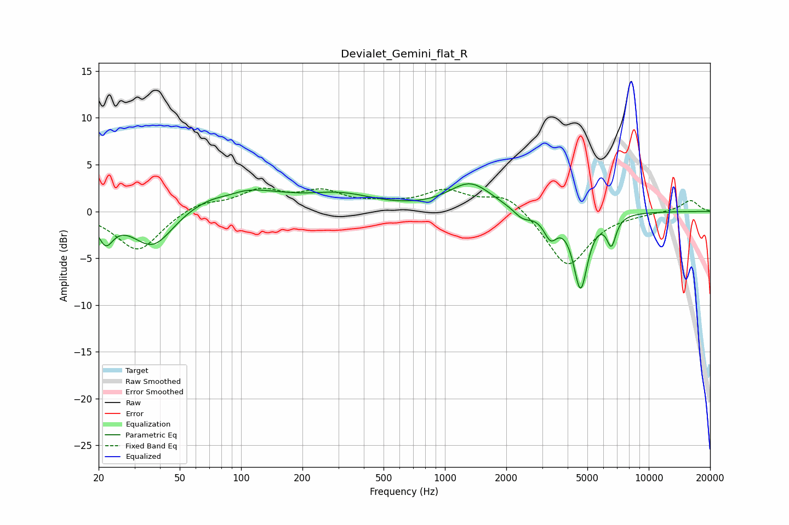

# Devialet_Gemini_flat_R
See [usage instructions](https://github.com/jaakkopasanen/AutoEq#usage) for more options and info.

### Parametric EQs
Apply preamp of -3.0 dB when using parametric equalizer.

|   # | Type    |   Fc (Hz) |    Q |   Gain (dB) |
|-----|---------|-----------|------|-------------|
|   1 | Peaking |        22 | 3.84 |        -2.8 |
|   2 | Peaking |        37 | 1.4  |        -4.2 |
|   3 | Peaking |        86 | 2.21 |        -0.4 |
|   4 | Peaking |        94 | 0.68 |         2.6 |
|   5 | Peaking |       311 | 0.86 |         1.5 |
|   6 | Peaking |      1333 | 1.34 |         2.9 |
|   7 | Peaking |      2407 | 3.2  |        -1   |
|   8 | Peaking |      3296 | 4.28 |        -2.3 |
|   9 | Peaking |      4628 | 3.98 |        -8   |
|  10 | Peaking |      6558 | 6    |        -3   |

### Fixed Band EQs
When using fixed band (also called graphic) equalizer, apply preamp of **-2.6 dB** (if available) and set gains manually with these parameters.

|   # | Type    |   Fc (Hz) |    Q |   Gain (dB) |
|-----|---------|-----------|------|-------------|
|   1 | Peaking |        31 | 1.41 |        -4.3 |
|   2 | Peaking |        62 | 1.41 |         1   |
|   3 | Peaking |       125 | 1.41 |         2.1 |
|   4 | Peaking |       250 | 1.41 |         1.8 |
|   5 | Peaking |       500 | 1.41 |         0.6 |
|   6 | Peaking |      1000 | 1.41 |         2   |
|   7 | Peaking |      2000 | 1.41 |         2   |
|   8 | Peaking |      4000 | 1.41 |        -6   |
|   9 | Peaking |      8000 | 1.41 |        -0.2 |
|  10 | Peaking |     16000 | 1.41 |         1.2 |

### Graphs

