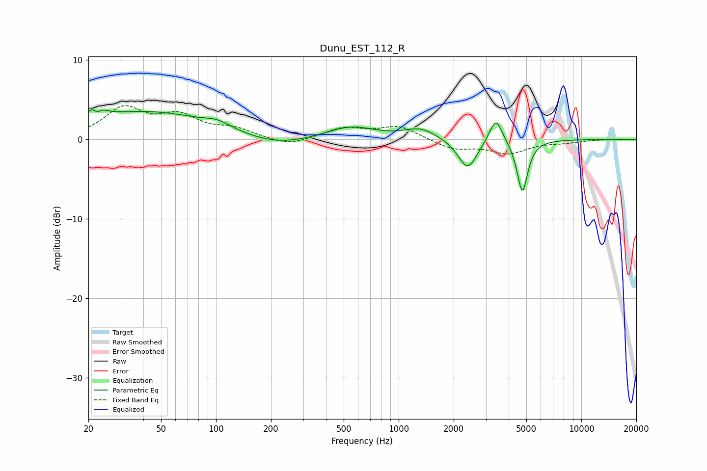

# Dunu_EST_112_R
See [usage instructions](https://github.com/jaakkopasanen/AutoEq#usage) for more options and info.

### Parametric EQs
Apply preamp of -3.8 dB when using parametric equalizer.

|   # | Type    |   Fc (Hz) |    Q |   Gain (dB) |
|-----|---------|-----------|------|-------------|
|   1 | Peaking |        22 | 4.16 |         3.1 |
|   2 | Peaking |        22 | 5.96 |        -2.3 |
|   3 | Peaking |        42 | 0.38 |         3.5 |
|   4 | Peaking |       102 | 2.12 |         0.7 |
|   5 | Peaking |       210 | 0.79 |        -1.2 |
|   6 | Peaking |       547 | 1.06 |         1.6 |
|   7 | Peaking |      1315 | 1.68 |         1.3 |
|   8 | Peaking |      2384 | 2.73 |        -3.8 |
|   9 | Peaking |      3404 | 4.01 |         3.2 |
|  10 | Peaking |      4757 | 4.79 |        -6.6 |

### Fixed Band EQs
When using fixed band (also called graphic) equalizer, apply preamp of **-4.3 dB** (if available) and set gains manually with these parameters.

|   # | Type    |   Fc (Hz) |    Q |   Gain (dB) |
|-----|---------|-----------|------|-------------|
|   1 | Peaking |        31 | 1.41 |         3.7 |
|   2 | Peaking |        62 | 1.41 |         2.6 |
|   3 | Peaking |       125 | 1.41 |         1.1 |
|   4 | Peaking |       250 | 1.41 |        -0.9 |
|   5 | Peaking |       500 | 1.41 |         1.4 |
|   6 | Peaking |      1000 | 1.41 |         1.6 |
|   7 | Peaking |      2000 | 1.41 |        -1.2 |
|   8 | Peaking |      4000 | 1.41 |        -1.6 |
|   9 | Peaking |      8000 | 1.41 |        -0.3 |
|  10 | Peaking |     16000 | 1.41 |         0   |

### Graphs

