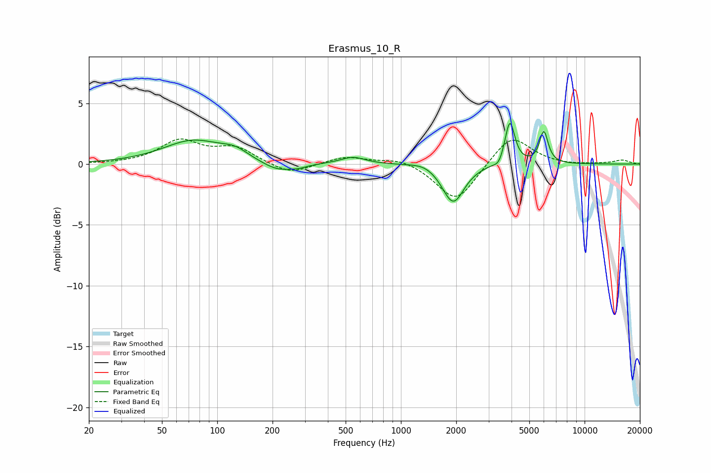

# Erasmus_10_R
See [usage instructions](https://github.com/jaakkopasanen/AutoEq#usage) for more options and info.

### Parametric EQs
Apply preamp of -3.4 dB when using parametric equalizer.

|   # | Type    |   Fc (Hz) |    Q |   Gain (dB) |
|-----|---------|-----------|------|-------------|
|   1 | Peaking |        74 | 0.87 |         1.9 |
|   2 | Peaking |       125 | 1.93 |         0.7 |
|   3 | Peaking |       214 | 1.58 |        -0.8 |
|   4 | Peaking |       279 | 3.09 |        -0.2 |
|   5 | Peaking |       548 | 2.08 |         0.6 |
|   6 | Peaking |      1344 | 1.96 |         0.4 |
|   7 | Peaking |      1925 | 2.4  |        -3.2 |
|   8 | Peaking |      3413 | 6    |        -0.5 |
|   9 | Peaking |      3918 | 5.36 |         3.6 |
|  10 | Peaking |      5998 | 6    |         2.6 |

### Fixed Band EQs
When using fixed band (also called graphic) equalizer, apply preamp of **-2.2 dB** (if available) and set gains manually with these parameters.

|   # | Type    |   Fc (Hz) |    Q |   Gain (dB) |
|-----|---------|-----------|------|-------------|
|   1 | Peaking |        31 | 1.41 |         0   |
|   2 | Peaking |        62 | 1.41 |         1.8 |
|   3 | Peaking |       125 | 1.41 |         1.3 |
|   4 | Peaking |       250 | 1.41 |        -0.9 |
|   5 | Peaking |       500 | 1.41 |         0.6 |
|   6 | Peaking |      1000 | 1.41 |         0.5 |
|   7 | Peaking |      2000 | 1.41 |        -3.2 |
|   8 | Peaking |      4000 | 1.41 |         2.5 |
|   9 | Peaking |      8000 | 1.41 |        -0.1 |
|  10 | Peaking |     16000 | 1.41 |         0.3 |

### Graphs

