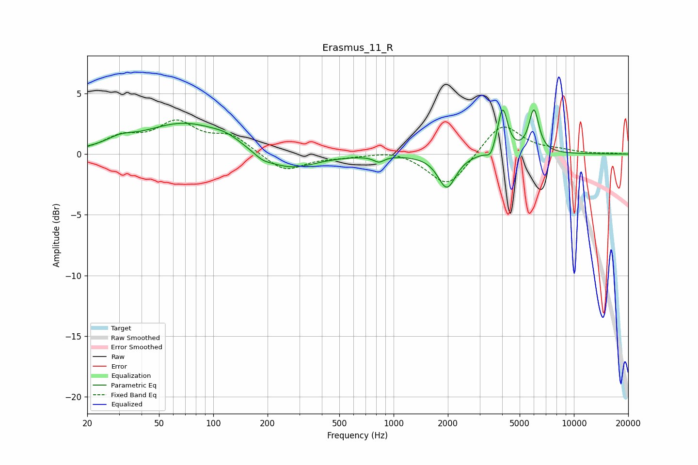

# Erasmus_11_R
See [usage instructions](https://github.com/jaakkopasanen/AutoEq#usage) for more options and info.

### Parametric EQs
Apply preamp of -3.8 dB when using parametric equalizer.

|   # | Type    |   Fc (Hz) |    Q |   Gain (dB) |
|-----|---------|-----------|------|-------------|
|   1 | Peaking |        30 | 1.9  |         0.6 |
|   2 | Peaking |        69 | 0.63 |         2.5 |
|   3 | Peaking |       118 | 1.83 |         0.5 |
|   4 | Peaking |       187 | 2.98 |        -0.4 |
|   5 | Peaking |       261 | 0.97 |        -1.4 |
|   6 | Peaking |       829 | 4.92 |        -0.5 |
|   7 | Peaking |      1974 | 2.91 |        -2.8 |
|   8 | Peaking |      3455 | 6    |        -0.8 |
|   9 | Peaking |      4022 | 5.11 |         3.8 |
|  10 | Peaking |      5999 | 5.06 |         3.5 |

### Fixed Band EQs
When using fixed band (also called graphic) equalizer, apply preamp of **-2.9 dB** (if available) and set gains manually with these parameters.

|   # | Type    |   Fc (Hz) |    Q |   Gain (dB) |
|-----|---------|-----------|------|-------------|
|   1 | Peaking |        31 | 1.41 |         1.2 |
|   2 | Peaking |        62 | 1.41 |         2.4 |
|   3 | Peaking |       125 | 1.41 |         1.4 |
|   4 | Peaking |       250 | 1.41 |        -1.5 |
|   5 | Peaking |       500 | 1.41 |        -0.2 |
|   6 | Peaking |      1000 | 1.41 |         0.4 |
|   7 | Peaking |      2000 | 1.41 |        -2.8 |
|   8 | Peaking |      4000 | 1.41 |         2.6 |
|   9 | Peaking |      8000 | 1.41 |         0.2 |
|  10 | Peaking |     16000 | 1.41 |         0.1 |

### Graphs

