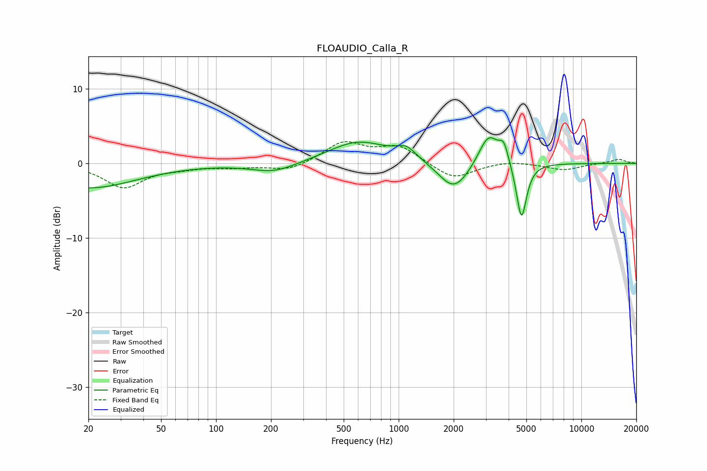

# FLOAUDIO_Calla_R
See [usage instructions](https://github.com/jaakkopasanen/AutoEq#usage) for more options and info.

### Parametric EQs
Apply preamp of -3.5 dB when using parametric equalizer.

|   # | Type    |   Fc (Hz) |    Q |   Gain (dB) |
|-----|---------|-----------|------|-------------|
|   1 | Peaking |        20 | 0.54 |        -3.3 |
|   2 | Peaking |       209 | 1.13 |        -1.3 |
|   3 | Peaking |       604 | 0.86 |         3   |
|   4 | Peaking |      1101 | 2.59 |         1.5 |
|   5 | Peaking |      1974 | 1.76 |        -3.2 |
|   6 | Peaking |      2175 | 1.88 |        -0.8 |
|   7 | Peaking |      3101 | 2.61 |         4.2 |
|   8 | Peaking |      3654 | 3.92 |         0.5 |
|   9 | Peaking |      3773 | 5.91 |         2   |
|  10 | Peaking |      4704 | 5.04 |        -7.7 |

### Fixed Band EQs
When using fixed band (also called graphic) equalizer, apply preamp of **-3.0 dB** (if available) and set gains manually with these parameters.

|   # | Type    |   Fc (Hz) |    Q |   Gain (dB) |
|-----|---------|-----------|------|-------------|
|   1 | Peaking |        31 | 1.41 |        -3.2 |
|   2 | Peaking |        62 | 1.41 |        -0.5 |
|   3 | Peaking |       125 | 1.41 |        -0.4 |
|   4 | Peaking |       250 | 1.41 |        -1   |
|   5 | Peaking |       500 | 1.41 |         2.8 |
|   6 | Peaking |      1000 | 1.41 |         2.2 |
|   7 | Peaking |      2000 | 1.41 |        -2.2 |
|   8 | Peaking |      4000 | 1.41 |         0.4 |
|   9 | Peaking |      8000 | 1.41 |        -0.9 |
|  10 | Peaking |     16000 | 1.41 |         0.6 |

### Graphs

