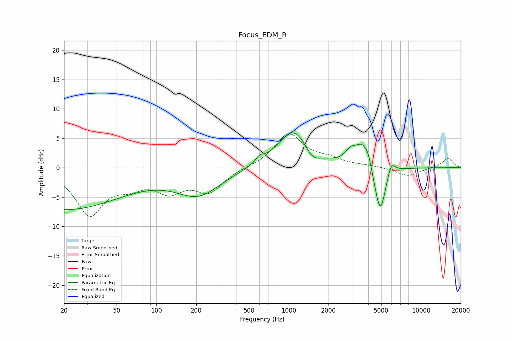

# Focus_EDM_R
See [usage instructions](https://github.com/jaakkopasanen/AutoEq#usage) for more options and info.

### Parametric EQs
Apply preamp of -6.0 dB when using parametric equalizer.

|   # | Type    |   Fc (Hz) |    Q |   Gain (dB) |
|-----|---------|-----------|------|-------------|
|   1 | Peaking |        20 | 0.31 |        -7.1 |
|   2 | Peaking |       207 | 0.83 |        -4.4 |
|   3 | Peaking |       603 | 4.46 |         1   |
|   4 | Peaking |      1091 | 1.18 |         6.6 |
|   5 | Peaking |      1508 | 2.44 |        -2   |
|   6 | Peaking |      2944 | 3.38 |         1.8 |
|   7 | Peaking |      3611 | 2.66 |         3.9 |
|   8 | Peaking |      3997 | 5.92 |         1.4 |
|   9 | Peaking |      4919 | 3.19 |        -8.6 |
|  10 | Peaking |      5949 | 4.29 |         2.5 |

### Fixed Band EQs
When using fixed band (also called graphic) equalizer, apply preamp of **-5.9 dB** (if available) and set gains manually with these parameters.

|   # | Type    |   Fc (Hz) |    Q |   Gain (dB) |
|-----|---------|-----------|------|-------------|
|   1 | Peaking |        31 | 1.41 |        -7.8 |
|   2 | Peaking |        62 | 1.41 |        -2.2 |
|   3 | Peaking |       125 | 1.41 |        -3.5 |
|   4 | Peaking |       250 | 1.41 |        -3.8 |
|   5 | Peaking |       500 | 1.41 |         0   |
|   6 | Peaking |      1000 | 1.41 |         5.7 |
|   7 | Peaking |      2000 | 1.41 |         1.2 |
|   8 | Peaking |      4000 | 1.41 |         0.3 |
|   9 | Peaking |      8000 | 1.41 |        -1.5 |
|  10 | Peaking |     16000 | 1.41 |         1.6 |

### Graphs

