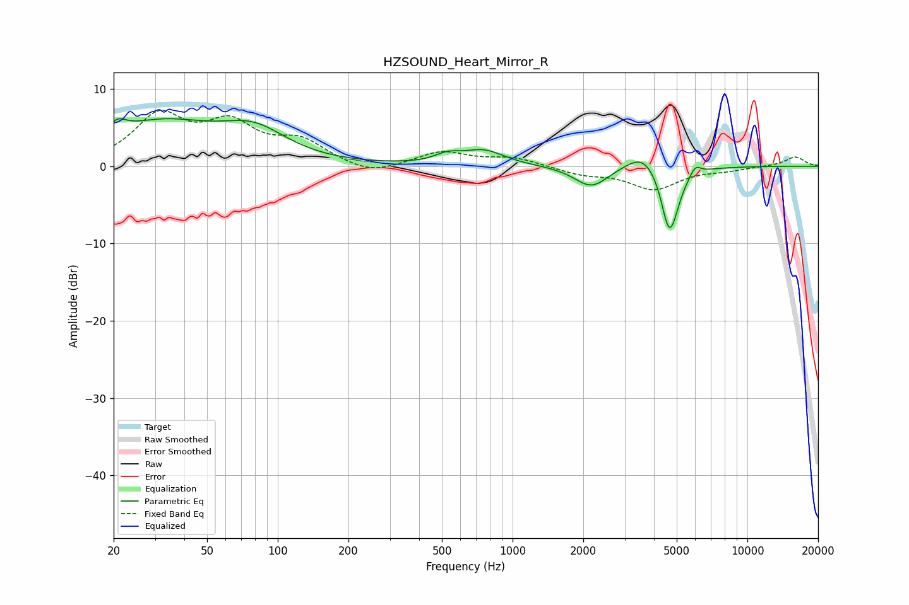

# HZSOUND_Heart_Mirror_R
See [usage instructions](https://github.com/jaakkopasanen/AutoEq#usage) for more options and info.

### Parametric EQs
Apply preamp of -6.2 dB when using parametric equalizer.

|   # | Type    |   Fc (Hz) |    Q |   Gain (dB) |
|-----|---------|-----------|------|-------------|
|   1 | Peaking |        21 | 3.87 |         1.6 |
|   2 | Peaking |        31 | 0.59 |         5.3 |
|   3 | Peaking |        80 | 1.02 |         3.6 |
|   4 | Peaking |       528 | 2.58 |         1   |
|   5 | Peaking |       753 | 1.61 |         1.9 |
|   6 | Peaking |      2165 | 1.98 |        -2.8 |
|   7 | Peaking |      3607 | 2.05 |         2.4 |
|   8 | Peaking |      4550 | 5.99 |        -1.5 |
|   9 | Peaking |      4714 | 3.58 |        -7.6 |
|  10 | Peaking |      5995 | 6    |         1.3 |

### Fixed Band EQs
When using fixed band (also called graphic) equalizer, apply preamp of **-7.3 dB** (if available) and set gains manually with these parameters.

|   # | Type    |   Fc (Hz) |    Q |   Gain (dB) |
|-----|---------|-----------|------|-------------|
|   1 | Peaking |        31 | 1.41 |         6.2 |
|   2 | Peaking |        62 | 1.41 |         4.8 |
|   3 | Peaking |       125 | 1.41 |         2.9 |
|   4 | Peaking |       250 | 1.41 |        -1.3 |
|   5 | Peaking |       500 | 1.41 |         1.8 |
|   6 | Peaking |      1000 | 1.41 |         1.1 |
|   7 | Peaking |      2000 | 1.41 |        -1   |
|   8 | Peaking |      4000 | 1.41 |        -2.9 |
|   9 | Peaking |      8000 | 1.41 |        -0.4 |
|  10 | Peaking |     16000 | 1.41 |         1.2 |

### Graphs

