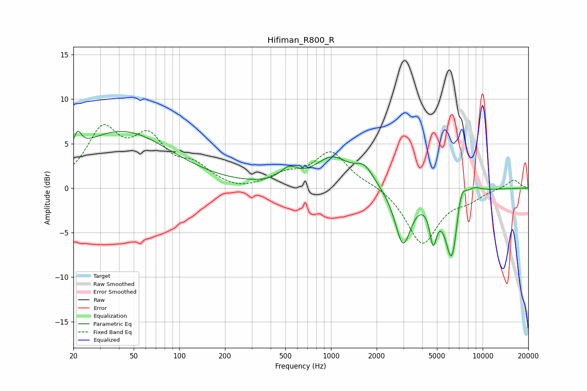

# Hifiman_R800_R
See [usage instructions](https://github.com/jaakkopasanen/AutoEq#usage) for more options and info.

### Parametric EQs
Apply preamp of -6.5 dB when using parametric equalizer.

|   # | Type    |   Fc (Hz) |    Q |   Gain (dB) |
|-----|---------|-----------|------|-------------|
|   1 | Peaking |        21 | 5.82 |         1.9 |
|   2 | Peaking |        42 | 0.43 |         6.3 |
|   3 | Peaking |       527 | 2.56 |         1.4 |
|   4 | Peaking |      1019 | 1.23 |         3.2 |
|   5 | Peaking |      1665 | 2.29 |         1.9 |
|   6 | Peaking |      2984 | 2.67 |        -6.3 |
|   7 | Peaking |      4718 | 6    |        -4.2 |
|   8 | Peaking |      6278 | 3.07 |        -8.5 |
|   9 | Peaking |      7169 | 3.84 |         3.2 |
|  10 | Peaking |      8770 | 2.67 |         0.7 |

### Fixed Band EQs
When using fixed band (also called graphic) equalizer, apply preamp of **-7.2 dB** (if available) and set gains manually with these parameters.

|   # | Type    |   Fc (Hz) |    Q |   Gain (dB) |
|-----|---------|-----------|------|-------------|
|   1 | Peaking |        31 | 1.41 |         6.1 |
|   2 | Peaking |        62 | 1.41 |         4.9 |
|   3 | Peaking |       125 | 1.41 |         2   |
|   4 | Peaking |       250 | 1.41 |        -0.5 |
|   5 | Peaking |       500 | 1.41 |         1.3 |
|   6 | Peaking |      1000 | 1.41 |         4   |
|   7 | Peaking |      2000 | 1.41 |         0.4 |
|   8 | Peaking |      4000 | 1.41 |        -6.3 |
|   9 | Peaking |      8000 | 1.41 |        -1   |
|  10 | Peaking |     16000 | 1.41 |         1   |

### Graphs

