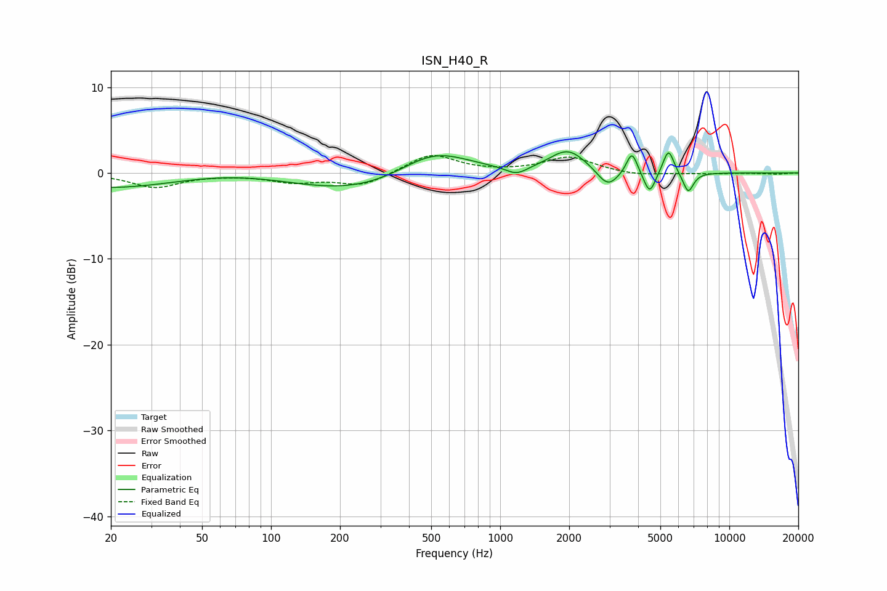

# ISN_H40_R
See [usage instructions](https://github.com/jaakkopasanen/AutoEq#usage) for more options and info.

### Parametric EQs
Apply preamp of -2.6 dB when using parametric equalizer.

|   # | Type    |   Fc (Hz) |    Q |   Gain (dB) |
|-----|---------|-----------|------|-------------|
|   1 | Peaking |        68 | 0.36 |         5.4 |
|   2 | Peaking |        81 | 0.18 |        -6.1 |
|   3 | Peaking |       511 | 0.84 |         3.9 |
|   4 | Peaking |      1179 | 3    |        -1   |
|   5 | Peaking |      1975 | 1.75 |         2.7 |
|   6 | Peaking |      2949 | 3.04 |        -2.1 |
|   7 | Peaking |      3758 | 6    |         2.6 |
|   8 | Peaking |      4490 | 5.61 |        -2.6 |
|   9 | Peaking |      5426 | 5.92 |         2.9 |
|  10 | Peaking |      6617 | 5.99 |        -2.4 |

### Fixed Band EQs
When using fixed band (also called graphic) equalizer, apply preamp of **-2.1 dB** (if available) and set gains manually with these parameters.

|   # | Type    |   Fc (Hz) |    Q |   Gain (dB) |
|-----|---------|-----------|------|-------------|
|   1 | Peaking |        31 | 1.41 |        -1.6 |
|   2 | Peaking |        62 | 1.41 |        -0.1 |
|   3 | Peaking |       125 | 1.41 |        -1   |
|   4 | Peaking |       250 | 1.41 |        -1.5 |
|   5 | Peaking |       500 | 1.41 |         2.2 |
|   6 | Peaking |      1000 | 1.41 |         0   |
|   7 | Peaking |      2000 | 1.41 |         1.8 |
|   8 | Peaking |      4000 | 1.41 |        -0.4 |
|   9 | Peaking |      8000 | 1.41 |        -0.1 |
|  10 | Peaking |     16000 | 1.41 |        -0.1 |

### Graphs

