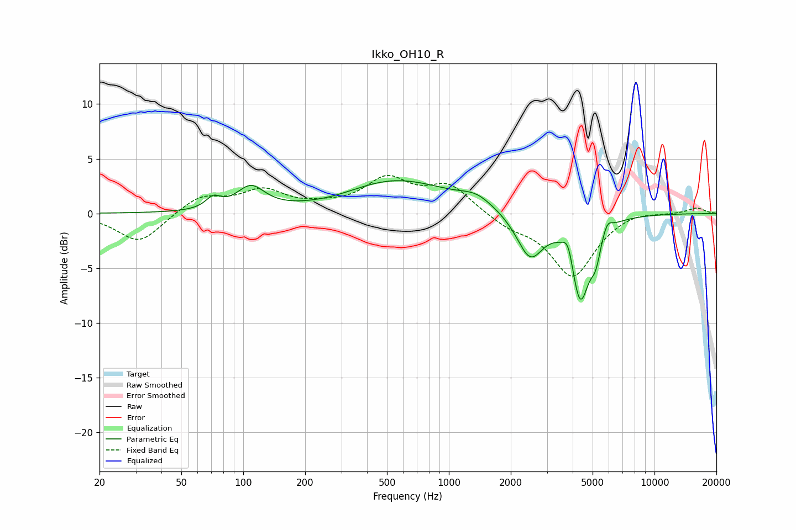

# Ikko_OH10_R
See [usage instructions](https://github.com/jaakkopasanen/AutoEq#usage) for more options and info.

### Parametric EQs
Apply preamp of -3.1 dB when using parametric equalizer.

|   # | Type    |   Fc (Hz) |    Q |   Gain (dB) |
|-----|---------|-----------|------|-------------|
|   1 | Peaking |        72 | 4.02 |         1   |
|   2 | Peaking |       109 | 2.09 |         2.2 |
|   3 | Peaking |       282 | 0.81 |        -0.5 |
|   4 | Peaking |       539 | 0.53 |         3.2 |
|   5 | Peaking |      1361 | 1.83 |         0.9 |
|   6 | Peaking |      2483 | 2.17 |        -4.1 |
|   7 | Peaking |      3809 | 5.5  |         2   |
|   8 | Peaking |      4349 | 3.02 |        -7.8 |
|   9 | Peaking |      5172 | 6    |        -2   |
|  10 | Peaking |      5891 | 6    |         1   |

### Fixed Band EQs
When using fixed band (also called graphic) equalizer, apply preamp of **-3.6 dB** (if available) and set gains manually with these parameters.

|   # | Type    |   Fc (Hz) |    Q |   Gain (dB) |
|-----|---------|-----------|------|-------------|
|   1 | Peaking |        31 | 1.41 |        -2.7 |
|   2 | Peaking |        62 | 1.41 |         1.6 |
|   3 | Peaking |       125 | 1.41 |         1.9 |
|   4 | Peaking |       250 | 1.41 |         0.4 |
|   5 | Peaking |       500 | 1.41 |         3   |
|   6 | Peaking |      1000 | 1.41 |         2.5 |
|   7 | Peaking |      2000 | 1.41 |        -1   |
|   8 | Peaking |      4000 | 1.41 |        -5.7 |
|   9 | Peaking |      8000 | 1.41 |         0.4 |
|  10 | Peaking |     16000 | 1.41 |         0.5 |

### Graphs

