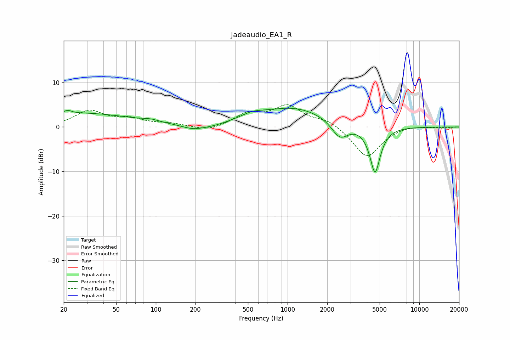

# Jadeaudio_EA1_R
See [usage instructions](https://github.com/jaakkopasanen/AutoEq#usage) for more options and info.

### Parametric EQs
Apply preamp of -4.3 dB when using parametric equalizer.

|   # | Type    |   Fc (Hz) |    Q |   Gain (dB) |
|-----|---------|-----------|------|-------------|
|   1 | Peaking |        21 | 5.77 |         2.7 |
|   2 | Peaking |        21 | 6    |        -2   |
|   3 | Peaking |        26 | 0.33 |         3.1 |
|   4 | Peaking |        91 | 2.37 |         0.5 |
|   5 | Peaking |       191 | 1.6  |        -1.1 |
|   6 | Peaking |       267 | 1.46 |        -0.5 |
|   7 | Peaking |       535 | 1.55 |         1.2 |
|   8 | Peaking |      1122 | 0.54 |         4.3 |
|   9 | Peaking |      2494 | 2.21 |        -3.9 |
|  10 | Peaking |      4612 | 3.42 |       -10.5 |

### Fixed Band EQs
When using fixed band (also called graphic) equalizer, apply preamp of **-5.1 dB** (if available) and set gains manually with these parameters.

|   # | Type    |   Fc (Hz) |    Q |   Gain (dB) |
|-----|---------|-----------|------|-------------|
|   1 | Peaking |        31 | 1.41 |         3.5 |
|   2 | Peaking |        62 | 1.41 |         1.6 |
|   3 | Peaking |       125 | 1.41 |         0.7 |
|   4 | Peaking |       250 | 1.41 |        -1.1 |
|   5 | Peaking |       500 | 1.41 |         2.7 |
|   6 | Peaking |      1000 | 1.41 |         4.5 |
|   7 | Peaking |      2000 | 1.41 |         1.6 |
|   8 | Peaking |      4000 | 1.41 |        -6.9 |
|   9 | Peaking |      8000 | 1.41 |         0.5 |
|  10 | Peaking |     16000 | 1.41 |        -0.1 |

### Graphs

