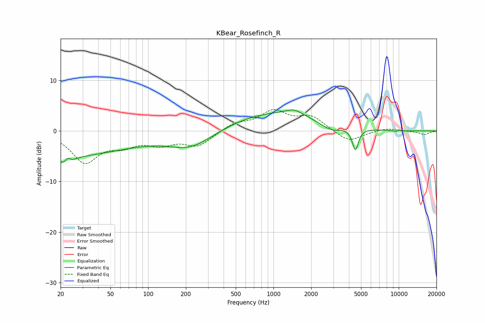

# KBear_Rosefinch_R
See [usage instructions](https://github.com/jaakkopasanen/AutoEq#usage) for more options and info.

### Parametric EQs
Apply preamp of -4.2 dB when using parametric equalizer.

|   # | Type    |   Fc (Hz) |    Q |   Gain (dB) |
|-----|---------|-----------|------|-------------|
|   1 | Peaking |        22 | 3.02 |        -2.8 |
|   2 | Peaking |        23 | 5.76 |         1.9 |
|   3 | Peaking |        24 | 0.29 |        -4.7 |
|   4 | Peaking |       220 | 0.77 |        -3.4 |
|   5 | Peaking |      1015 | 0.38 |         3.7 |
|   6 | Peaking |      1463 | 2.14 |         1.1 |
|   7 | Peaking |      2859 | 1.67 |        -1.6 |
|   8 | Peaking |      4503 | 5.89 |        -4.3 |
|   9 | Peaking |      9978 | 5.2  |        -2.9 |
|  10 | Peaking |     10000 | 5.86 |         2.9 |

### Fixed Band EQs
When using fixed band (also called graphic) equalizer, apply preamp of **-4.3 dB** (if available) and set gains manually with these parameters.

|   # | Type    |   Fc (Hz) |    Q |   Gain (dB) |
|-----|---------|-----------|------|-------------|
|   1 | Peaking |        31 | 1.41 |        -5.9 |
|   2 | Peaking |        62 | 1.41 |        -2.2 |
|   3 | Peaking |       125 | 1.41 |        -2.2 |
|   4 | Peaking |       250 | 1.41 |        -2.8 |
|   5 | Peaking |       500 | 1.41 |         1.5 |
|   6 | Peaking |      1000 | 1.41 |         3.7 |
|   7 | Peaking |      2000 | 1.41 |         2.7 |
|   8 | Peaking |      4000 | 1.41 |        -2.3 |
|   9 | Peaking |      8000 | 1.41 |         0.6 |
|  10 | Peaking |     16000 | 1.41 |        -0.7 |

### Graphs

