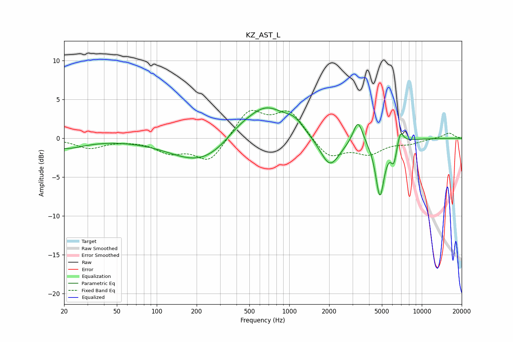

# KZ_AST_L
See [usage instructions](https://github.com/jaakkopasanen/AutoEq#usage) for more options and info.

### Parametric EQs
Apply preamp of -4.0 dB when using parametric equalizer.

|   # | Type    |   Fc (Hz) |    Q |   Gain (dB) |
|-----|---------|-----------|------|-------------|
|   1 | Peaking |        20 | 0.95 |        -1.3 |
|   2 | Peaking |       219 | 0.62 |        -3.3 |
|   3 | Peaking |       407 | 1.37 |         1   |
|   4 | Peaking |       661 | 0.89 |         4.4 |
|   5 | Peaking |      1098 | 2.14 |         1.2 |
|   6 | Peaking |      2027 | 1.88 |        -3.9 |
|   7 | Peaking |      3299 | 3.99 |         3   |
|   8 | Peaking |      4831 | 4.25 |        -7.3 |
|   9 | Peaking |      6152 | 6    |        -2.5 |
|  10 | Peaking |      6890 | 5.87 |         1.8 |

### Fixed Band EQs
When using fixed band (also called graphic) equalizer, apply preamp of **-3.7 dB** (if available) and set gains manually with these parameters.

|   # | Type    |   Fc (Hz) |    Q |   Gain (dB) |
|-----|---------|-----------|------|-------------|
|   1 | Peaking |        31 | 1.41 |        -1.2 |
|   2 | Peaking |        62 | 1.41 |        -0.1 |
|   3 | Peaking |       125 | 1.41 |        -1.6 |
|   4 | Peaking |       250 | 1.41 |        -3.1 |
|   5 | Peaking |       500 | 1.41 |         3.6 |
|   6 | Peaking |      1000 | 1.41 |         3.4 |
|   7 | Peaking |      2000 | 1.41 |        -2.6 |
|   8 | Peaking |      4000 | 1.41 |        -1.8 |
|   9 | Peaking |      8000 | 1.41 |        -0.6 |
|  10 | Peaking |     16000 | 1.41 |         0.7 |

### Graphs

